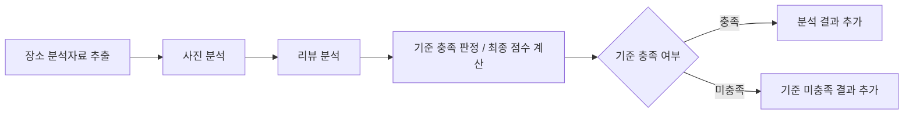

# Analysis Nodes Implementation Plan

> **For agentic workers:** REQUIRED SUB-SKILL: Use superpowers:subagent-driven-development (recommended) or superpowers:executing-plans to implement this plan task-by-task. Steps use checkbox (`- [ ]`) syntax for tracking.

**Goal:** 사전 필터 없이 장소 사진과 리뷰를 사용자 기준으로 분석하고, `analyzed`·`not_matched`·`failed`를 구분할 수 있는 2-4 분석 계층을 구현한다.

**Architecture:** `datespot_agent.analysis` 패키지에 비동기 OpenAI 사진/리뷰 Agent와 순수 점수 Service를 분리한다. Agent는 `AsyncOpenAI.responses.parse()`와 Pydantic 모델로 구조화된 분석을 반환하고, Service는 활성 가중치·기준 충족 여부·가중합만 결정한다. LangGraph 연결과 실패 결과 누적은 각각 2-5와 2-6으로 남긴다.

**Tech Stack:** Python 3.13, Pydantic 2.13+, OpenAI Python SDK 2.45+, 표준 라이브러리 `unittest`

## Global Constraints

- 사전 필터, 필터 설정, `excluded` 결과를 제품 계약에서 제거한다.
- 사진·리뷰 점수는 0부터 10까지 정수다.
- 최종 점수는 0부터 10까지 소수점 첫째 자리이며 `ROUND_HALF_UP`으로 반올림한다.
- 가중치가 0보다 큰 분석 항목 하나라도 `matched=false`이면 장소 상태는 `not_matched`다.
- 가중치가 0보다 큰 항목의 입력 또는 분석 결과가 없으면 `AnalysisInputError`다.
- 가중치가 0%인 항목은 호출, 입력 검사, 기준 충족 판정, 점수 계산에서 제외한다.
- 사진은 최대 5장, 리뷰는 최대 50개를 DOM 순서대로 분석한다.
- OpenAI Agent는 `AsyncOpenAI.responses.parse()`와 `PhotoAnalysis` 또는 `ReviewAnalysis` Pydantic 형식을 사용한다.
- 기본 테스트는 실제 OpenAI API와 네이버 실사이트를 호출하지 않는다.
- 모든 프로덕션 변경은 RED → GREEN → REFACTOR 순서로 진행한다.
- 기존 사용자 변경인 `README.md`는 현재 내용을 보존하며 필요한 부분만 편집한다.
- `.playwright-cli/`는 범위 밖이며 stage하지 않는다.

---

### Task 1: 코어 모델에서 필터 계약 제거 및 분석 상태 확장

**Files:**
- Modify: `tests/test_models.py`
- Modify: `src/datespot_agent/models.py`
- Modify: `src/datespot_agent/config.py`

**Interfaces:**
- Consumes: 기존 `CamelModel`, `Weights`, `ScoringCriteria`, `PlaceDetail`
- Produces: `PhotoAnalysis(photo_score, matched, reason)`, `ReviewAnalysis(review_score, matched, reason)`, `PlaceResultStatus.NOT_MATCHED`, 소수 `PlaceResult.final_score`, `PlaceResult.mismatch_reason`

- [ ] **Step 1: 필터 제거와 신규 상태를 요구하는 실패 테스트 작성**

`tests/test_models.py`에서 `FilterDecision` import를 제거하고 다음 테스트 계약으로 갱신한다.

```python
class RunConfigTests(unittest.TestCase):
    def test_accepts_snake_and_camel_and_serializes_aliases(self):
        snake = RunConfig(location=" 신사역 ", search_keyword="음식점")
        camel = RunConfig.model_validate(
            {
                "location": "강남역",
                "searchKeyword": "일식",
                "maxPlaces": 3,
                "weights": {"photoPercent": 60, "reviewPercent": 40},
            }
        )

        self.assertEqual(snake.location, "신사역")
        self.assertEqual(camel.search_keyword, "일식")
        payload = camel.model_dump(by_alias=True)
        self.assertEqual(payload["maxPlaces"], 3)
        self.assertEqual(payload["weights"]["photoPercent"], 60)
        self.assertNotIn("filters", payload)
        self.assertNotIn("search_keyword", payload)

    def test_rejects_out_of_range_unknown_and_removed_filter_fields(self):
        for max_places in (0, 11):
            with self.subTest(max_places=max_places):
                with self.assertRaises(ValidationError):
                    RunConfig(
                        location="신사역",
                        search_keyword="음식점",
                        max_places=max_places,
                    )

        with self.assertRaises(ValidationError):
            RunConfig(location=" ", search_keyword="음식점")
        with self.assertRaises(ValidationError):
            RunConfig.model_validate(
                {
                    "location": "신사역",
                    "searchKeyword": "음식점",
                    "filters": {"categories": ["일식"]},
                }
            )
        with self.assertRaises(ValidationError):
            RunConfig.model_validate(
                {
                    "location": "신사역",
                    "searchKeyword": "음식점",
                    "unexpectedField": True,
                }
            )

    def test_weights_require_percentages_totaling_100(self):
        self.assertEqual(Weights().photo_percent, 50)
        with self.assertRaises(ValidationError):
            Weights(photo_percent=40, review_percent=40)
        with self.assertRaises(ValidationError):
            Weights(photo_percent=101, review_percent=-1)

    def test_nested_scoring_defaults_are_independent(self):
        first = RunConfig(location="신사역", search_keyword="음식점")
        second = RunConfig(location="강남역", search_keyword="음식점")

        first.scoring.photo = "밝고 활기찬 분위기"

        self.assertNotEqual(first.scoring.photo, second.scoring.photo)
```

`PlaceAndAnalysisModelTests`의 분석 모델 테스트를 다음으로 바꾼다.

```python
def test_analysis_models_require_match_and_integer_score_in_range(self):
    photo = PhotoAnalysis(photo_score=7, matched=True, reason="차분함")
    review = ReviewAnalysis(review_score=8, matched=False, reason="소음 근거가 있음")

    self.assertTrue(photo.matched)
    self.assertFalse(review.matched)

    for score in (-1, 11, 7.5):
        with self.subTest(score=score):
            with self.assertRaises(ValidationError):
                PhotoAnalysis(photo_score=score, matched=True, reason="근거")

    with self.assertRaises(ValidationError):
        PhotoAnalysis(photo_score=7, reason="근거")

def test_identifying_fields_and_reasons_cannot_be_blank(self):
    with self.assertRaises(ValidationError):
        CandidatePlace(place_id=" ", name="우니도")
    with self.assertRaises(ValidationError):
        ReviewAnalysis(review_score=8, matched=True, reason=" ")
```

`ResultAndReportModelTests`의 상태 테스트를 다음으로 바꾼다.

```python
def test_place_result_requires_fields_for_each_status(self):
    invalid_payloads = (
        {"status": "analyzed", "name": "우니도"},
        {"status": "not_matched", "name": "우니도"},
        {"status": "failed", "name": "우니도"},
        {"status": "excluded", "name": "우니도", "exclusionReason": "리뷰 부족"},
    )

    for payload in invalid_payloads:
        with self.subTest(status=payload["status"]):
            with self.assertRaises(ValidationError):
                PlaceResult.model_validate(payload)

def test_place_result_accepts_one_decimal_final_score(self):
    result = PlaceResult(
        status="analyzed",
        place_id="1720070048",
        name="우니도",
        final_score=7.5,
    )

    self.assertEqual(result.final_score, 7.5)
    with self.assertRaises(ValidationError):
        PlaceResult(status="analyzed", name="우니도", final_score=7.55)

def test_not_matched_requires_reason_and_forbids_final_score(self):
    result = PlaceResult(
        status="not_matched",
        name="우니도",
        photo_score=6,
        photo_reason="사진 기준 미충족",
        mismatch_reason="사진 기준 미충족: 사진 기준 미충족",
    )

    self.assertIsNone(result.final_score)
    with self.assertRaises(ValidationError):
        PlaceResult(
            status="not_matched",
            name="우니도",
            final_score=6.0,
            mismatch_reason="사진 기준 미충족",
        )
```

리포트 직렬화 테스트의 결과를 `not_matched`로 바꾼다.

```python
results=[
    PlaceResult(
        status="not_matched",
        name="우니도",
        mismatch_reason="리뷰 기준 미충족",
    )
],
```

```python
self.assertEqual(payload["results"][0]["mismatchReason"], "리뷰 기준 미충족")
```

`GraphStateModelTests`에 제거된 상태 필드 거부 테스트를 추가한다.

```python
def test_rejects_removed_filter_decision(self):
    with self.assertRaises(ValidationError):
        GraphState.model_validate(
            {
                "runId": "run-1",
                "config": {"location": "신사역", "searchKeyword": "음식점"},
                "filterDecision": {"passed": True},
            }
        )
```

- [ ] **Step 2: 모델 테스트를 실행해 RED 확인**

Run:

```bash
uv run python -m unittest discover -s tests -p 'test_models.py' -v
```

Expected: `RunConfig`가 `filters`를 계속 직렬화하거나, `matched`·`not_matched`·소수 최종 점수 계약이 없어 실패함.

- [ ] **Step 3: 코어 모델을 최소 변경해 GREEN 달성**

`src/datespot_agent/models.py`에서 `Filters`, `FilterDecision`을 삭제하고 다음 계약을 적용한다.

```python
class RunConfig(CamelModel):
    location: str = Field(min_length=1)
    search_keyword: str = Field(min_length=1)
    max_places: int = Field(default=10, ge=1, le=10)
    weights: Weights = Field(default_factory=Weights)
    scoring: ScoringCriteria = Field(default_factory=ScoringCriteria)


class PhotoAnalysis(CamelModel):
    photo_score: int = Field(ge=0, le=10)
    matched: bool
    reason: str = Field(min_length=1)


class ReviewAnalysis(CamelModel):
    review_score: int = Field(ge=0, le=10)
    matched: bool
    reason: str = Field(min_length=1)
```

상태와 결과 모델을 다음으로 교체한다.

```python
class PlaceResultStatus(str, Enum):
    ANALYZED = "analyzed"
    NOT_MATCHED = "not_matched"
    FAILED = "failed"


class PlaceResult(CamelModel):
    status: PlaceResultStatus
    place_id: str | None = Field(default=None, min_length=1)
    name: str = Field(min_length=1)
    category: str | None = None
    address: str | None = None
    photo_score: int | None = Field(default=None, ge=0, le=10)
    review_score: int | None = Field(default=None, ge=0, le=10)
    final_score: float | None = Field(default=None, ge=0, le=10, multiple_of=0.1)
    photo_reason: str | None = None
    review_reason: str | None = None
    mismatch_reason: str | None = None
    failure_reason: str | None = None

    @model_validator(mode="after")
    def validate_status_fields(self) -> "PlaceResult":
        if self.status is PlaceResultStatus.ANALYZED:
            if self.final_score is None:
                raise ValueError("분석 완료 결과에는 final_score가 필요하다")
            if self.mismatch_reason is not None:
                raise ValueError("분석 완료 결과에는 mismatch_reason을 넣을 수 없다")
        if self.status is PlaceResultStatus.NOT_MATCHED:
            if not self.mismatch_reason:
                raise ValueError("기준 미충족 결과에는 mismatch_reason이 필요하다")
            if self.final_score is not None:
                raise ValueError("기준 미충족 결과에는 final_score를 넣을 수 없다")
        if self.status is PlaceResultStatus.FAILED and not self.failure_reason:
            raise ValueError("실패 결과에는 failure_reason이 필요하다")
        return self
```

`GraphState`에서 다음 필드를 삭제한다.

```python
filter_decision: FilterDecision | None = None
```

`src/datespot_agent/config.py` import와 `__all__`에서 `Filters`를 삭제한다.

```python
from datespot_agent.models import RunConfig, ScoringCriteria, Weights
```

- [ ] **Step 4: 모델 테스트와 전체 테스트를 실행해 GREEN 확인**

Run:

```bash
uv run python -m unittest discover -s tests -p 'test_models.py' -v
uv run python -m unittest discover -s tests -v
```

Expected: 모두 `OK`.

- [ ] **Step 5: 모델 계약 변경 커밋**

```bash
git add src/datespot_agent/models.py src/datespot_agent/config.py tests/test_models.py
git commit -m "refactor: replace place filters with match status"
```

---

### Task 2: 사진 분석 Agent

**Files:**
- Create: `src/datespot_agent/analysis/__init__.py`
- Create: `src/datespot_agent/analysis/errors.py`
- Create: `src/datespot_agent/analysis/photo.py`
- Create: `tests/test_photo_analysis_agent.py`

**Interfaces:**
- Consumes: `PlaceDetail`, `PhotoAnalysis`, 주입된 `AsyncOpenAI`
- Produces: `AnalysisError`, `AnalysisInputError`, `AnalysisRequestError`, `AnalysisResponseError`, `PhotoAnalysisAgent.analyze(detail, criteria)`

- [ ] **Step 1: 사진 Agent 실패 테스트 작성**

`tests/test_photo_analysis_agent.py`를 생성한다.

```python
from __future__ import annotations

import unittest
from types import SimpleNamespace

from datespot_agent.analysis import (
    AnalysisInputError,
    AnalysisRequestError,
    AnalysisResponseError,
    PhotoAnalysisAgent,
)
from datespot_agent.models import PhotoAnalysis, PlaceDetail


class FakeResponses:
    def __init__(self, parsed=None, error: Exception | None = None):
        self.parsed = parsed
        self.error = error
        self.kwargs = None

    async def parse(self, **kwargs):
        self.kwargs = kwargs
        if self.error is not None:
            raise self.error
        return SimpleNamespace(output_parsed=self.parsed)


class PhotoAnalysisAgentTests(unittest.IsolatedAsyncioTestCase):
    async def test_analyze_uses_criteria_and_at_most_five_photos(self):
        parsed = PhotoAnalysis(photo_score=8, matched=True, reason="차분한 조명")
        responses = FakeResponses(parsed=parsed)
        client = SimpleNamespace(responses=responses)
        agent = PhotoAnalysisAgent(client, model="gpt-5.4-nano", max_output_tokens=700)
        detail = PlaceDetail(
            place_id="1",
            name="우니도",
            category="일식당",
            address="서울 강남구",
            photo_urls=[f"https://example.com/{index}.jpg" for index in range(7)],
        )

        result = await agent.analyze(detail, "어둡고 차분한 분위기")

        self.assertIs(result, parsed)
        self.assertEqual(responses.kwargs["model"], "gpt-5.4-nano")
        self.assertEqual(responses.kwargs["max_output_tokens"], 700)
        self.assertIs(responses.kwargs["text_format"], PhotoAnalysis)
        content = responses.kwargs["input"][0]["content"]
        self.assertIn("어둡고 차분한 분위기", content[0]["text"])
        self.assertIn("matched", content[0]["text"])
        self.assertEqual(len(content[1:]), 5)
        self.assertTrue(all(block["type"] == "input_image" for block in content[1:]))

    async def test_empty_photos_raise_input_error_without_api_call(self):
        responses = FakeResponses()
        agent = PhotoAnalysisAgent(SimpleNamespace(responses=responses), model="model")

        with self.assertRaises(AnalysisInputError):
            await agent.analyze(PlaceDetail(place_id="1", name="우니도"), "차분함")

        self.assertIsNone(responses.kwargs)

    async def test_missing_parsed_output_raises_response_error(self):
        agent = PhotoAnalysisAgent(
            SimpleNamespace(responses=FakeResponses(parsed=None)),
            model="model",
        )
        detail = PlaceDetail(
            place_id="1",
            name="우니도",
            photo_urls=["https://example.com/1.jpg"],
        )

        with self.assertRaises(AnalysisResponseError):
            await agent.analyze(detail, "차분함")

    async def test_request_failure_is_wrapped_with_cause(self):
        original = RuntimeError("network down")
        agent = PhotoAnalysisAgent(
            SimpleNamespace(responses=FakeResponses(error=original)),
            model="model",
        )
        detail = PlaceDetail(
            place_id="1",
            name="우니도",
            photo_urls=["https://example.com/1.jpg"],
        )

        with self.assertRaises(AnalysisRequestError) as caught:
            await agent.analyze(detail, "차분함")

        self.assertIs(caught.exception.__cause__, original)


if __name__ == "__main__":
    unittest.main()
```

- [ ] **Step 2: 사진 Agent 테스트를 실행해 RED 확인**

Run:

```bash
uv run python -m unittest discover -s tests -p 'test_photo_analysis_agent.py' -v
```

Expected: `ModuleNotFoundError: No module named 'datespot_agent.analysis'`.

- [ ] **Step 3: 예외 계층과 사진 Agent 최소 구현**

`src/datespot_agent/analysis/errors.py`를 생성한다.

```python
class AnalysisError(Exception):
    """장소 분석 계층의 기반 예외."""


class AnalysisInputError(AnalysisError):
    """분석에 필요한 입력 또는 중간 결과가 없는 경우."""


class AnalysisRequestError(AnalysisError):
    """외부 분석 모델 요청이 실패한 경우."""


class AnalysisResponseError(AnalysisError):
    """외부 분석 모델의 구조화 응답을 사용할 수 없는 경우."""
```

`src/datespot_agent/analysis/photo.py`를 생성한다.

```python
from __future__ import annotations

from openai import AsyncOpenAI

from datespot_agent.analysis.errors import (
    AnalysisInputError,
    AnalysisRequestError,
    AnalysisResponseError,
)
from datespot_agent.models import PhotoAnalysis, PlaceDetail

MAX_PHOTOS = 5
DEFAULT_MAX_OUTPUT_TOKENS = 700

SYSTEM_PROMPT = (
    "너는 소개팅 장소를 내부 사진으로 평가하는 공간 분석가다. "
    "사진에서 직접 확인되는 근거와 추정을 구분하고 구조화된 결과만 반환한다."
)


def build_photo_prompt(detail: PlaceDetail, criteria: str) -> str:
    return (
        f"장소명: {detail.name}\n"
        f"카테고리: {detail.category or '확인 불가'}\n"
        f"주소: {detail.address or '확인 불가'}\n"
        f"사진 평가 기준: {criteria}\n\n"
        "조명, 좌석 배치, 공간감, 혼잡 신호, 대화 적합성을 평가한다. "
        "photo_score는 0~10 정수다. "
        "사진 근거가 평가 기준을 전체적으로 충족할 때만 matched=true로 판단한다. "
        "확인할 수 없는 조건은 충족한 것으로 간주하지 말고 reason에 명시한다."
    )


class PhotoAnalysisAgent:
    def __init__(
        self,
        client: AsyncOpenAI,
        *,
        model: str,
        max_output_tokens: int = DEFAULT_MAX_OUTPUT_TOKENS,
    ) -> None:
        self._client = client
        self._model = model
        self._max_output_tokens = max_output_tokens

    async def analyze(self, detail: PlaceDetail, criteria: str) -> PhotoAnalysis:
        photo_urls = [url for url in detail.photo_urls if url][:MAX_PHOTOS]
        if not photo_urls:
            raise AnalysisInputError(f"사진 분석 자료가 없음: {detail.name}")

        content = [{"type": "input_text", "text": build_photo_prompt(detail, criteria)}]
        content.extend(
            {"type": "input_image", "image_url": url, "detail": "low"}
            for url in photo_urls
        )

        try:
            response = await self._client.responses.parse(
                model=self._model,
                instructions=SYSTEM_PROMPT,
                max_output_tokens=self._max_output_tokens,
                input=[{"role": "user", "content": content}],
                text_format=PhotoAnalysis,
            )
        except Exception as exc:
            raise AnalysisRequestError(f"사진 분석 요청 실패: {detail.name}") from exc

        parsed = response.output_parsed
        if not isinstance(parsed, PhotoAnalysis):
            raise AnalysisResponseError(f"사진 분석 구조화 응답 없음: {detail.name}")
        return parsed
```

`src/datespot_agent/analysis/__init__.py`를 생성한다.

```python
from datespot_agent.analysis.errors import (
    AnalysisError,
    AnalysisInputError,
    AnalysisRequestError,
    AnalysisResponseError,
)
from datespot_agent.analysis.photo import PhotoAnalysisAgent

__all__ = [
    "AnalysisError",
    "AnalysisInputError",
    "AnalysisRequestError",
    "AnalysisResponseError",
    "PhotoAnalysisAgent",
]
```

- [ ] **Step 4: 사진 Agent 테스트와 전체 테스트를 실행해 GREEN 확인**

Run:

```bash
uv run python -m unittest discover -s tests -p 'test_photo_analysis_agent.py' -v
uv run python -m unittest discover -s tests -v
```

Expected: 모두 `OK`.

- [ ] **Step 5: 사진 Agent 커밋**

```bash
git add src/datespot_agent/analysis tests/test_photo_analysis_agent.py
git commit -m "feat: add structured photo analysis agent"
```

---

### Task 3: 리뷰 분석 Agent

**Files:**
- Create: `src/datespot_agent/analysis/review.py`
- Create: `tests/test_review_analysis_agent.py`
- Modify: `src/datespot_agent/analysis/__init__.py`

**Interfaces:**
- Consumes: Task 1의 `ReviewAnalysis`, Task 2의 분석 예외 계층, 주입된 `AsyncOpenAI`
- Produces: `ReviewAnalysisAgent.analyze(detail, criteria)`

- [ ] **Step 1: 리뷰 Agent 실패 테스트 작성**

`tests/test_review_analysis_agent.py`를 생성한다.

```python
from __future__ import annotations

import unittest
from types import SimpleNamespace

from datespot_agent.analysis import (
    AnalysisInputError,
    AnalysisRequestError,
    AnalysisResponseError,
    ReviewAnalysisAgent,
)
from datespot_agent.models import PlaceDetail, ReviewAnalysis


class FakeResponses:
    def __init__(self, parsed=None, error: Exception | None = None):
        self.parsed = parsed
        self.error = error
        self.kwargs = None

    async def parse(self, **kwargs):
        self.kwargs = kwargs
        if self.error is not None:
            raise self.error
        return SimpleNamespace(output_parsed=self.parsed)


class ReviewAnalysisAgentTests(unittest.IsolatedAsyncioTestCase):
    async def test_analyze_uses_criteria_and_at_most_fifty_reviews(self):
        parsed = ReviewAnalysis(review_score=8, matched=True, reason="조용함 언급")
        responses = FakeResponses(parsed=parsed)
        client = SimpleNamespace(responses=responses)
        agent = ReviewAnalysisAgent(client, model="gpt-5.4-nano", max_output_tokens=700)
        detail = PlaceDetail(
            place_id="1",
            name="우니도",
            category="일식당",
            address="서울 강남구",
            reviews=[f"리뷰 {index}" for index in range(55)],
            review_count=128,
        )

        result = await agent.analyze(detail, "조용하고 대화하기 좋음")

        self.assertIs(result, parsed)
        self.assertEqual(responses.kwargs["model"], "gpt-5.4-nano")
        self.assertEqual(responses.kwargs["max_output_tokens"], 700)
        self.assertIs(responses.kwargs["text_format"], ReviewAnalysis)
        text = responses.kwargs["input"][0]["content"][0]["text"]
        self.assertIn("조용하고 대화하기 좋음", text)
        self.assertIn("matched", text)
        self.assertIn("50. 리뷰 49", text)
        self.assertNotIn("리뷰 50", text)

    async def test_empty_reviews_raise_input_error_without_api_call(self):
        responses = FakeResponses()
        agent = ReviewAnalysisAgent(SimpleNamespace(responses=responses), model="model")

        with self.assertRaises(AnalysisInputError):
            await agent.analyze(PlaceDetail(place_id="1", name="우니도"), "조용함")

        self.assertIsNone(responses.kwargs)

    async def test_missing_parsed_output_raises_response_error(self):
        agent = ReviewAnalysisAgent(
            SimpleNamespace(responses=FakeResponses(parsed=None)),
            model="model",
        )
        detail = PlaceDetail(place_id="1", name="우니도", reviews=["조용해요"])

        with self.assertRaises(AnalysisResponseError):
            await agent.analyze(detail, "조용함")

    async def test_request_failure_is_wrapped_with_cause(self):
        original = RuntimeError("network down")
        agent = ReviewAnalysisAgent(
            SimpleNamespace(responses=FakeResponses(error=original)),
            model="model",
        )
        detail = PlaceDetail(place_id="1", name="우니도", reviews=["조용해요"])

        with self.assertRaises(AnalysisRequestError) as caught:
            await agent.analyze(detail, "조용함")

        self.assertIs(caught.exception.__cause__, original)


if __name__ == "__main__":
    unittest.main()
```

- [ ] **Step 2: 리뷰 Agent 테스트를 실행해 RED 확인**

Run:

```bash
uv run python -m unittest discover -s tests -p 'test_review_analysis_agent.py' -v
```

Expected: `ImportError: cannot import name 'ReviewAnalysisAgent'`.

- [ ] **Step 3: 리뷰 Agent 최소 구현**

`src/datespot_agent/analysis/review.py`를 생성한다.

```python
from __future__ import annotations

from openai import AsyncOpenAI

from datespot_agent.analysis.errors import (
    AnalysisInputError,
    AnalysisRequestError,
    AnalysisResponseError,
)
from datespot_agent.models import PlaceDetail, ReviewAnalysis

MAX_REVIEWS = 50
DEFAULT_MAX_OUTPUT_TOKENS = 700

SYSTEM_PROMPT = (
    "너는 소개팅 장소를 방문자 리뷰로 평가하는 분석가다. "
    "리뷰에 직접 나타난 근거와 추정을 구분하고 구조화된 결과만 반환한다."
)


def build_review_prompt(detail: PlaceDetail, criteria: str, reviews: list[str]) -> str:
    numbered = "\n".join(
        f"{index}. {review}" for index, review in enumerate(reviews, start=1)
    )
    return (
        f"장소명: {detail.name}\n"
        f"카테고리: {detail.category or '확인 불가'}\n"
        f"주소: {detail.address or '확인 불가'}\n"
        f"전체 리뷰 수: {detail.review_count}\n"
        f"리뷰 평가 기준: {criteria}\n\n"
        "조용함, 대화 적합성, 친절함, 청결함, 대기·혼잡, "
        "데이트 적합성을 리뷰 근거로 평가한다. "
        "review_score는 0~10 정수다. "
        "리뷰 근거가 평가 기준을 전체적으로 충족할 때만 matched=true로 판단한다. "
        "직접 근거가 부족하면 충족한 것으로 간주하지 말고 reason에 명시한다.\n\n"
        f"리뷰 목록:\n{numbered}"
    )


class ReviewAnalysisAgent:
    def __init__(
        self,
        client: AsyncOpenAI,
        *,
        model: str,
        max_output_tokens: int = DEFAULT_MAX_OUTPUT_TOKENS,
    ) -> None:
        self._client = client
        self._model = model
        self._max_output_tokens = max_output_tokens

    async def analyze(self, detail: PlaceDetail, criteria: str) -> ReviewAnalysis:
        reviews = [review for review in detail.reviews if review][:MAX_REVIEWS]
        if not reviews:
            raise AnalysisInputError(f"리뷰 분석 자료가 없음: {detail.name}")

        try:
            response = await self._client.responses.parse(
                model=self._model,
                instructions=SYSTEM_PROMPT,
                max_output_tokens=self._max_output_tokens,
                input=[
                    {
                        "role": "user",
                        "content": [
                            {
                                "type": "input_text",
                                "text": build_review_prompt(detail, criteria, reviews),
                            }
                        ],
                    }
                ],
                text_format=ReviewAnalysis,
            )
        except Exception as exc:
            raise AnalysisRequestError(f"리뷰 분석 요청 실패: {detail.name}") from exc

        parsed = response.output_parsed
        if not isinstance(parsed, ReviewAnalysis):
            raise AnalysisResponseError(f"리뷰 분석 구조화 응답 없음: {detail.name}")
        return parsed
```

`src/datespot_agent/analysis/__init__.py`에 다음을 추가한다.

```python
from datespot_agent.analysis.review import ReviewAnalysisAgent
```

```python
"ReviewAnalysisAgent",
```

- [ ] **Step 4: 리뷰 Agent 테스트와 전체 테스트를 실행해 GREEN 확인**

Run:

```bash
uv run python -m unittest discover -s tests -p 'test_review_analysis_agent.py' -v
uv run python -m unittest discover -s tests -v
```

Expected: 모두 `OK`.

- [ ] **Step 5: 리뷰 Agent 커밋**

```bash
git add src/datespot_agent/analysis tests/test_review_analysis_agent.py
git commit -m "feat: add structured review analysis agent"
```

---

### Task 4: 기준 충족 판정과 최종 점수 Service

**Files:**
- Create: `src/datespot_agent/analysis/scoring.py`
- Create: `tests/test_place_scoring_service.py`
- Modify: `src/datespot_agent/analysis/__init__.py`

**Interfaces:**
- Consumes: `PlaceDetail`, `Weights`, `PhotoAnalysis | None`, `ReviewAnalysis | None`
- Produces: `PlaceScoringService.calculate(...) -> PlaceResult`

- [ ] **Step 1: 상태와 점수 계산 실패 테스트 작성**

`tests/test_place_scoring_service.py`를 생성한다.

```python
from __future__ import annotations

import unittest

from datespot_agent.analysis import AnalysisInputError, PlaceScoringService
from datespot_agent.models import PhotoAnalysis, PlaceDetail, ReviewAnalysis, Weights


class PlaceScoringServiceTests(unittest.TestCase):
    def setUp(self):
        self.service = PlaceScoringService()
        self.detail = PlaceDetail(
            place_id="1720070048",
            name="우니도",
            category="일식당",
            address="서울 강남구",
        )

    def test_calculates_one_decimal_weighted_score(self):
        result = self.service.calculate(
            self.detail,
            Weights(photo_percent=50, review_percent=50),
            PhotoAnalysis(photo_score=7, matched=True, reason="차분함"),
            ReviewAnalysis(review_score=8, matched=True, reason="조용함"),
        )

        self.assertEqual(result.status.value, "analyzed")
        self.assertEqual(result.final_score, 7.5)
        self.assertEqual(result.photo_score, 7)
        self.assertEqual(result.review_score, 8)

    def test_rounds_half_up_to_one_decimal(self):
        result = self.service.calculate(
            self.detail,
            Weights(photo_percent=55, review_percent=45),
            PhotoAnalysis(photo_score=7, matched=True, reason="차분함"),
            ReviewAnalysis(review_score=8, matched=True, reason="조용함"),
        )

        self.assertEqual(result.final_score, 7.5)

    def test_zero_weight_component_is_not_required_or_scored(self):
        result = self.service.calculate(
            self.detail,
            Weights(photo_percent=0, review_percent=100),
            None,
            ReviewAnalysis(review_score=8, matched=True, reason="조용함"),
        )

        self.assertEqual(result.status.value, "analyzed")
        self.assertEqual(result.final_score, 8.0)
        self.assertIsNone(result.photo_score)

    def test_missing_active_analysis_raises_input_error(self):
        with self.assertRaises(AnalysisInputError):
            self.service.calculate(
                self.detail,
                Weights(photo_percent=50, review_percent=50),
                None,
                ReviewAnalysis(review_score=8, matched=True, reason="조용함"),
            )

    def test_any_active_mismatch_returns_not_matched_with_reasons(self):
        result = self.service.calculate(
            self.detail,
            Weights(photo_percent=50, review_percent=50),
            PhotoAnalysis(photo_score=6, matched=False, reason="좌석 간격 확인 불가"),
            ReviewAnalysis(review_score=8, matched=False, reason="소음 우려"),
        )

        self.assertEqual(result.status.value, "not_matched")
        self.assertIsNone(result.final_score)
        self.assertEqual(result.photo_score, 6)
        self.assertEqual(result.review_score, 8)
        self.assertEqual(
            result.mismatch_reason,
            "사진 기준 미충족: 좌석 간격 확인 불가; 리뷰 기준 미충족: 소음 우려",
        )


if __name__ == "__main__":
    unittest.main()
```

- [ ] **Step 2: 점수 Service 테스트를 실행해 RED 확인**

Run:

```bash
uv run python -m unittest discover -s tests -p 'test_place_scoring_service.py' -v
```

Expected: `ImportError: cannot import name 'PlaceScoringService'`.

- [ ] **Step 3: 점수 Service 최소 구현**

`src/datespot_agent/analysis/scoring.py`를 생성한다.

```python
from __future__ import annotations

from decimal import Decimal, ROUND_HALF_UP

from datespot_agent.analysis.errors import AnalysisInputError
from datespot_agent.models import (
    PhotoAnalysis,
    PlaceDetail,
    PlaceResult,
    ReviewAnalysis,
    Weights,
)

ONE_DECIMAL = Decimal("0.1")


class PlaceScoringService:
    def calculate(
        self,
        detail: PlaceDetail,
        weights: Weights,
        photo_analysis: PhotoAnalysis | None,
        review_analysis: ReviewAnalysis | None,
    ) -> PlaceResult:
        photo_active = weights.photo_percent > 0
        review_active = weights.review_percent > 0

        if photo_active and photo_analysis is None:
            raise AnalysisInputError(f"사진 분석 결과가 없음: {detail.name}")
        if review_active and review_analysis is None:
            raise AnalysisInputError(f"리뷰 분석 결과가 없음: {detail.name}")

        photo = photo_analysis if photo_active else None
        review = review_analysis if review_active else None
        common = {
            "place_id": detail.place_id,
            "name": detail.name,
            "category": detail.category,
            "address": detail.address,
            "photo_score": photo.photo_score if photo else None,
            "review_score": review.review_score if review else None,
            "photo_reason": photo.reason if photo else None,
            "review_reason": review.reason if review else None,
        }

        mismatches: list[str] = []
        if photo is not None and not photo.matched:
            mismatches.append(f"사진 기준 미충족: {photo.reason}")
        if review is not None and not review.matched:
            mismatches.append(f"리뷰 기준 미충족: {review.reason}")
        if mismatches:
            return PlaceResult(
                status="not_matched",
                mismatch_reason="; ".join(mismatches),
                **common,
            )

        weighted_total = Decimal(0)
        if photo is not None:
            weighted_total += Decimal(photo.photo_score * weights.photo_percent)
        if review is not None:
            weighted_total += Decimal(review.review_score * weights.review_percent)
        final_score = float(
            (weighted_total / Decimal(100)).quantize(
                ONE_DECIMAL,
                rounding=ROUND_HALF_UP,
            )
        )

        return PlaceResult(status="analyzed", final_score=final_score, **common)
```

`src/datespot_agent/analysis/__init__.py`에 다음을 추가한다.

```python
from datespot_agent.analysis.scoring import PlaceScoringService
```

```python
"PlaceScoringService",
```

- [ ] **Step 4: 점수 Service 테스트와 전체 테스트를 실행해 GREEN 확인**

Run:

```bash
uv run python -m unittest discover -s tests -p 'test_place_scoring_service.py' -v
uv run python -m unittest discover -s tests -v
```

Expected: 모두 `OK`.

- [ ] **Step 5: 점수 Service 커밋**

```bash
git add src/datespot_agent/analysis tests/test_place_scoring_service.py
git commit -m "feat: add place match and scoring service"
```

---

### Task 5: 제품·기획·코어 문서에서 필터 제거

**Files:**
- Modify: `README.md`
- Modify: `idea.md`
- Modify: `poc/00-planning.md`
- Modify: `poc/1-2-naver-map-flow/README.md`
- Modify: `docs/superpowers/specs/2026-07-12-langgraph-agent-core-design.md`
- Modify: `docs/superpowers/specs/2026-07-13-browser-service-design.md`
- Modify: `docs/superpowers/plans/2026-07-13-agent-core-models.md`

**Interfaces:**
- Consumes: Tasks 1~4에서 확정된 현재 코드 계약
- Produces: 사전 필터·제외 상태가 없고 `not_matched`를 설명하는 일관된 활성 문서

- [ ] **Step 1: README 로드맵과 사용자 설정을 현재 계약으로 수정**

`README.md`에 다음 문구를 반영한다.

```markdown
- [x] **2-4 분석 계층 구현**: 사진 분석, 리뷰 분석, 기준 충족 판정, 점수 계산
- [ ] **2-5 LangGraph 실행 루프 구현**: 후보 검색 → 장소 순회 → 분석 → 리포트 반영
- [ ] **2-7 JSON 리포트 출력**: 분석/기준 미충족/실패 장소를 하나의 결과로 저장
```

프론트엔드 항목은 다음으로 바꾼다.

```markdown
- [ ] 취향 설정 폼 (탐색 조건 + 사진·리뷰 평가 기준 + 점수 가중치)
- [ ] 최종 리포트 뷰 (점수순 정렬, 기준 미충족 사유 포함)
```

`사용자 취향 설정`에서 사전 필터 절을 제거하고 점수 조건만 유지한다. 리포트와
에이전트 설명은 다음 계약으로 바꾼다.

```markdown
- 정상 분석 장소의 사진·리뷰 점수와 판단 근거
- 사용자 기준을 충족하지 못한 장소와 미충족 사유
- 분석 처리에 실패한 장소와 실패 사유
```

```markdown
- **서브 에이전트**: 개별 장소의 사진과 리뷰를 분석해 점수와 기준 충족 여부를 산출.
```

- [ ] **Step 2: 아이디어와 0단계 기획서에서 필터 기능 제거**

`idea.md`의 `사전 필터링 조건`, `장소 필터링`, 제외 장소 리포트 설명을 삭제한다.
장소 분석과 리포트 설명에 다음 내용을 반영한다.

```markdown
사진과 리뷰를 사용자 기준으로 분석하고, 각 기준의 충족 여부와 점수를 함께 산출함.
기준을 충족하지 못한 장소도 미충족 사유와 함께 리포트에 기록함.
```

`poc/00-planning.md`에서 필터 제외 원칙과 `filters:` YAML block을 삭제하고 다음
결정을 추가한다.

```markdown
- 후보 장소는 사전 필터 없이 설정된 최대 개수까지 순차 분석한다.
- 사진 또는 리뷰 기준을 충족하지 못한 장소는 `not_matched`로 기록한다.
- 분석 입력/API/응답 오류는 `failed`로 구분한다.
```

확정 요약 표의 점수 척도는 다음으로 현재화한다.

```markdown
| 점수 척도 | 사진·리뷰 0~10 정수, 최종 점수 소수점 첫째 자리 |
```

- [ ] **Step 3: PoC와 BrowserService 문서의 후속 범위 정리**

`poc/1-2-naver-map-flow/README.md`의 후속 단계 문구를 다음으로 바꾼다.

```markdown
- 여러 장소 순회·사진/리뷰 분석·점수화는 이후 단계(2단계 에이전트 코어)에서 다룬다.
```

`docs/superpowers/specs/2026-07-13-browser-service-design.md` 범위 제외에서
`거리 계산, 거리 필드, 거리 기반 필터`를 다음으로 바꾼다.

```markdown
- 거리 계산과 거리 필드
```

- [ ] **Step 4: LangGraph 코어 설계를 신규 상태 흐름으로 수정**

`docs/superpowers/specs/2026-07-12-langgraph-agent-core-design.md`에서 다음을
일관되게 적용한다.

- `validate`는 최대 장소 수와 가중치만 검증
- `preFilter`, `routeFilter`, `recordExcluded`, `appendExcluded` node와 edge 삭제
- 추출 성공 경로를 `analyzePhotos → analyzeReviews → calculate`로 직접 연결
- `calculate` 뒤 `routeMatch` 조건 분기 추가
- `routeMatch`의 `기준 충족`은 `appendAnalyzed`, `기준 미충족`은 `appendNotMatched`
- `PlaceResultStatus`는 `analyzed`, `not_matched`, `failed`
- `RunConfig`에서 `filters`와 `Filters` 절 삭제
- `PhotoAnalysis`, `ReviewAnalysis`에 `matched: bool` 추가
- `FilterDecision` 절 삭제
- `PlaceResult`에서 `exclusion_reason` 삭제, `mismatch_reason` 추가
- `PlaceResult.final_score`를 소수점 첫째 자리 값으로 변경하고 예시도 7.5로 갱신
- `GraphState`에서 `filter_decision` 삭제
- `PlaceScoringService` 책임에 기준 충족 판정과 `not_matched` 결과 생성을 포함
- `PlaceResultService`의 제외 결과 변환 책임 삭제

다이어그램의 분석 경로는 다음 의미를 가져야 한다.



- [ ] **Step 5: 완료된 2-2 계획에 계약 변경 안내 추가**

`docs/superpowers/plans/2026-07-13-agent-core-models.md` 제목 아래에 다음 안내를
추가한다. 과거 RED/GREEN 실행 단계 본문은 기록 보존을 위해 재작성하지 않는다.

```markdown
> **현재 계약 안내(2026-07-13):** 2-4 분석 계층 설계에서 사전 필터 계약을 제거하고
> 분석 기준 충족 여부를 `not_matched`로 분리했다. 현재 모델 계약은
> `docs/superpowers/specs/2026-07-13-analysis-nodes-design.md`와
> `src/datespot_agent/models.py`를 기준으로 한다. 아래 내용은 2-2 구현 당시의 실행
> 기록이다.
```

- [ ] **Step 6: 문서 계약 검색과 diff 검사**

Run:

```bash
rg -n "사전 필터|필터링으로 제외|PlaceResultStatus.EXCLUDED|exclusion_reason|filter_decision|min_review_count" \
  README.md idea.md poc/00-planning.md poc/1-2-naver-map-flow/README.md \
  docs/superpowers/specs/2026-07-12-langgraph-agent-core-design.md \
  docs/superpowers/specs/2026-07-13-browser-service-design.md
git diff --check
```

Expected: 첫 명령은 결과 없음. `git diff --check` exit code `0`.

- [ ] **Step 7: 문서 변경 커밋**

```bash
git add README.md idea.md poc/00-planning.md poc/1-2-naver-map-flow/README.md \
  docs/superpowers/specs/2026-07-12-langgraph-agent-core-design.md \
  docs/superpowers/specs/2026-07-13-browser-service-design.md \
  docs/superpowers/plans/2026-07-13-agent-core-models.md
git commit -m "docs: remove prefiltering from agent workflow"
```

---

### Task 6: 최종 회귀 검증

**Files:**
- Verify only: 전체 변경 파일

**Interfaces:**
- Consumes: Tasks 1~5 전체 결과
- Produces: 2-4 완료 근거

- [ ] **Step 1: 분석 계층 대상 테스트 실행**

Run:

```bash
uv run python -m unittest discover -s tests -p 'test_*analysis_agent.py' -v
uv run python -m unittest discover -s tests -p 'test_place_scoring_service.py' -v
```

Expected: 모두 `OK`.

- [ ] **Step 2: 전체 단위 테스트 실행**

Run:

```bash
uv run python -m unittest discover -s tests -v
```

Expected: exit code `0`, 모든 테스트 `OK`.

- [ ] **Step 3: 환경 스모크 테스트 실행**

Run:

```bash
uv run python poc/1-1-env/smoke_test.py
```

Expected: `전체 통과`, exit code `0`.

- [ ] **Step 4: 모델 직렬화 스모크 확인**

Run:

```bash
uv run python - <<'PY'
from datespot_agent.analysis import PlaceScoringService
from datespot_agent.models import PhotoAnalysis, PlaceDetail, ReviewAnalysis, Weights

result = PlaceScoringService().calculate(
    PlaceDetail(place_id="1", name="우니도"),
    Weights(photo_percent=50, review_percent=50),
    PhotoAnalysis(photo_score=7, matched=True, reason="사진 기준 충족"),
    ReviewAnalysis(review_score=8, matched=True, reason="리뷰 기준 충족"),
)
payload = result.model_dump(mode="json", by_alias=True)
assert payload["status"] == "analyzed"
assert payload["finalScore"] == 7.5
assert "exclusionReason" not in payload
print(payload)
PY
```

Expected: `status=analyzed`, `finalScore=7.5`, 제외 필드 없음.

- [ ] **Step 5: 저장소 상태와 범위 확인**

Run:

```bash
git status --short
git log --oneline -6
```

Expected: 계획 범위의 추적 파일은 모두 커밋됨. 사용자 소유 `.playwright-cli/`만
미추적 상태로 남을 수 있음.
