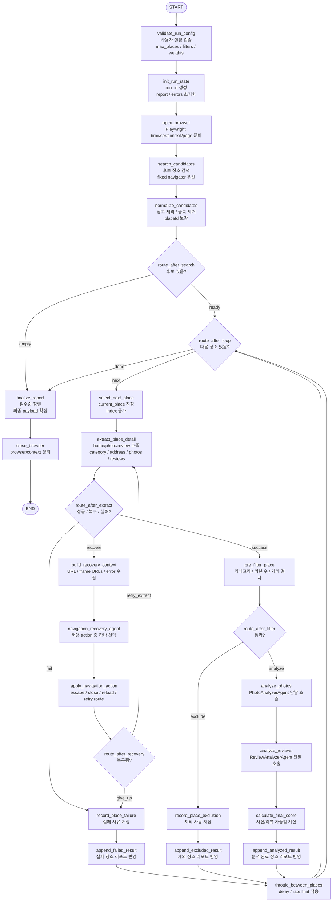

# LangGraph + Agent Core Design

## 개요

datespot-agent의 전체 실행은 LangGraph workflow가 관리한다.

큰 흐름은 사용자의 탐색 설정을 검증한 뒤, 네이버지도에서 후보 장소를 찾고, 장소를 하나씩 순차 분석하며, 결과를 리포트에 누적하는 구조다.

Agent는 전체 흐름을 자율적으로 결정하지 않는다. 사진 분석, 리뷰 분석, 브라우저 복구처럼 판단이 필요한 일부 지점에서만 단발성으로 호출한다. 실행 상태와 누적 컨텍스트는 Agent memory가 아니라 LangGraph state가 관리한다.

핵심 방향:

- LangGraph가 실행 순서와 루프를 통제함
- Playwright fixed router가 기본 브라우저 이동을 담당함
- Navigation recovery agent는 실패 시에만 제한적으로 호출함
- Photo/Review analyzer agent는 장소별 단발 호출함
- 필터링, 점수 계산, 다음 장소 선택은 코드로 고정함
- 장소 하나가 실패해도 전체 실행은 계속함

## LangGraph node 흐름

아래 다이어그램은 LangGraph 구현 관점의 node 흐름이다.

- 사각형: `add_node` 대상
- 마름모: `add_conditional_edges`에서 사용하는 routing 함수
- Agent는 node 안에서 단발 호출됨
- `route_after_loop`가 장소 순차 처리 루프를 통제함

## 데이터 모델 초안

이 단계에서는 구체 JSON schema를 정하지 않는다. 각 모델이 어떤 정보를 책임지는지만 정한다.

### GraphState

LangGraph node 사이를 이동하는 최소 실행 state다. Playwright 객체는 포함하지 않는다.

포함 정보:

- `run_id`: 실행 식별자
- `config`: 사용자 실행 설정
- `status`: 실행 상태
- `candidates`: 정규화된 후보 장소 목록
- `current_place_index`: 현재 처리 중인 후보 index
- `current_place`: 현재 후보 장소
- `current_place_detail`: 현재 장소 상세 추출 결과
- `filter_decision`: 현재 장소 필터 판단
- `photo_analysis`: 현재 장소 사진 분석 결과
- `review_analysis`: 현재 장소 리뷰 분석 결과
- `recovery_decision`: 최근 navigation 복구 판단
- `place_results`: 분석/제외/실패 장소 결과 목록
- `final_report`: 최종 리포트 payload
- `last_error`: 최근 오류 요약

제외 정보:

- Playwright `Browser`, `BrowserContext`, `Page`, `Locator`
- 전체 이벤트 히스토리
- node별 상태 히스토리
- screenshot path
- DOM snapshot
- 전체 retry history

### RunConfig

사용자가 한 번의 탐색 실행에서 지정하는 설정이다. 운영 옵션은 아직 포함하지 않는다.

포함 정보:

- `location`: 기준 지역 또는 역
- `search_keyword`: 검색 키워드 또는 카테고리
- `max_places`: 최대 분석 장소 수
- `filters`: 사전 필터 조건
- `weights`: 사진/리뷰 점수 가중치
- `scoring`: 사진/리뷰 평가 기준 문장

필터 정보:

- 포함 카테고리
- 최소 리뷰 수
- 최대 거리

보류 정보:

- delay / rate limit
- headless 여부
- 모델명
- retry 횟수
- viewport

### CandidatePlace

검색 목록에서 얻은 후보 장소다. 상세 분석 전 단계에서 사용한다.

포함 정보:

- 장소 ID
- 장소명
- 목록 순위
- 카테고리 힌트
- 광고 여부
- 목록 원문 텍스트
- 상세 URL 힌트

### PlaceDetail

상세 페이지에서 추출한 분석 재료다. 사진/리뷰 분석 node의 입력이 된다.

포함 정보:

- 장소 ID
- 장소명
- 카테고리
- 주소
- 거리 힌트
- home/photos/reviews route
- 사진 URL 목록
- 리뷰 텍스트 목록
- 리뷰 수
- 추출 시각
- 추출 오류

### PhotoAnalysis

사진 기반 소개팅 적합도 분석 결과다.

포함 정보:

- 사진 점수
- 사진 기반 요약
- 분위기 신호
- 좌석/공간 신호
- 조명 신호
- 부정 신호
- 대표 사진 URL
- 신뢰도

### ReviewAnalysis

리뷰 기반 소개팅 적합도 분석 결과다.

포함 정보:

- 리뷰 점수
- 리뷰 기반 요약
- 긍정 신호
- 부정 신호
- 데이트 적합 신호
- 우려 사항
- 분석에 사용한 리뷰 수
- 신뢰도

### PlaceResult

리포트에 누적되는 장소 단위 결과다. 분석 완료, 제외, 실패를 하나의 모델에서 상태값으로 구분한다.

포함 정보:

- 상태: `analyzed`, `excluded`, `failed`
- 장소 기본 정보
- 사진 점수
- 리뷰 점수
- 최종 점수
- 사진/리뷰 요약
- 핵심 근거
- 우려 사항
- 대표 사진
- 샘플 리뷰
- 제외 사유
- 실패 사유
- 오류 목록

### FilterDecision

사전 필터 node의 판단 결과다.

포함 정보:

- 통과 여부
- 제외 사유
- 적용된 필터
- 판단에 사용한 장소 정보 요약

### RecoveryDecision

navigation 복구 agent의 판단 결과다.

포함 정보:

- 진단 요약
- 선택한 복구 action
- 선택 이유
- 재시도 가능 여부

라우팅 결정은 별도 모델로 만들지 않는다. `route_after_*` 함수의 문자열 반환값으로 처리한다.

## 인터페이스 초안

구체 함수 시그니처는 아직 정하지 않는다. node가 의존할 외부 능력의 경계만 정한다.

### BrowserRuntime

Playwright live object를 관리한다. LangGraph state에는 `run_id`만 저장하고, 실제 browser/context/page는 runtime registry 또는 dependency injection으로 접근한다.

책임:

- browser/context/page 생성
- run_id 기준 세션 조회
- 세션 종료

### FixedNavigator

네이버지도 이동과 데이터 추출의 기본 경로다. LLM을 사용하지 않는다.

책임:

- 후보 장소 검색
- 후보 정규화에 필요한 원천 정보 제공
- 장소 상세 route 진입
- 사진 URL 추출
- 리뷰 텍스트 추출

### NavigationRecoveryAgent

fixed navigator 실패 시에만 호출되는 제한적 agent다.

입력 정보:

- 현재 목표
- 현재 URL
- frame URL 목록
- 최근 오류
- 허용된 action 목록

출력 정보:

- 복구 진단
- 선택한 action
- 이유

### NavigationActionExecutor

agent가 선택한 복구 action을 같은 Playwright page에 적용한다.

책임:

- escape
- popup close
- reload
- direct route retry
- 실패 확정

### PhotoAnalyzer

사진 분석 agent 호출을 감싼 인터페이스다.

입력 정보:

- 장소 기본 정보
- 사진 URL 목록
- 사진 평가 기준

출력 정보:

- `PhotoAnalysis`

### ReviewAnalyzer

리뷰 분석 agent 호출을 감싼 인터페이스다.

입력 정보:

- 장소 기본 정보
- 리뷰 목록
- 리뷰 평가 기준

출력 정보:

- `ReviewAnalysis`

### ScoreCalculator

LLM을 사용하지 않는 순수 계산 로직이다.

책임:

- 사진 점수와 리뷰 점수 가중합 계산
- 점수 없음/부분 분석 상황 처리

