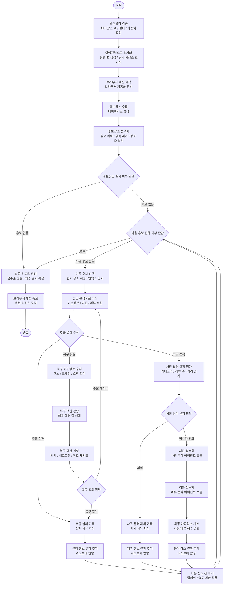

# LangGraph + Agent Core Design

## 개요

datespot-agent의 전체 실행은 LangGraph workflow가 관리한다.

큰 흐름은 사용자의 탐색 설정을 검증한 뒤, 네이버지도에서 후보 장소를 찾고, 장소를 하나씩 순차 분석하며, 결과를 리포트에 누적하는 구조다.

Agent는 전체 흐름을 자율적으로 결정하지 않는다. 사진 분석, 리뷰 분석, 브라우저 복구처럼 판단이 필요한 일부 지점에서만 단발성으로 호출한다. 실행 상태와 누적 컨텍스트는 Agent memory가 아니라 LangGraph state가 관리한다.

핵심 방향:

- LangGraph가 실행 순서와 루프를 통제함
- Playwright fixed router가 기본 브라우저 이동을 담당함
- Navigation recovery agent는 실패 시에만 제한적으로 호출함
- Photo/Review analyzer agent는 장소별 단발 호출함
- 필터링, 점수 계산, 다음 장소 선택은 코드로 고정함
- 장소 하나가 실패해도 전체 실행은 계속함

## LangGraph node 흐름

아래 다이어그램은 LangGraph 구현 관점의 node 흐름이다.

- 사각형: `add_node` 대상
- 마름모: `add_conditional_edges`에서 사용하는 routing 함수
- Agent는 node 안에서 단발 호출됨
- `route_after_loop`가 장소 순차 처리 루프를 통제함
- Mermaid node ID는 실제 함수명 후보이며, 화면 라벨은 한국어 설명으로 둔다.



## 데이터 규격

2-2 단계에서는 실행 설정, 장소 후보, 상세 추출값, 분석 결과, 리포트, LangGraph state를 Pydantic `BaseModel`로 구현한다.

공통 규칙:

- Python 내부 필드는 `snake_case`를 사용한다.
- JSON/API 입출력은 `camelCase` alias를 지원한다.
- 입력은 `snake_case`와 `camelCase`를 모두 허용한다.
- 출력 JSON은 `camelCase`로 직렬화할 수 있어야 한다.
- 점수는 `0`부터 `10`까지의 정수다.
- 리스트 필드는 `None` 대신 빈 배열을 기본값으로 쓴다.
- 선택 필드는 값이 없으면 `None`으로 둔다.
- 시간 필드는 UTC `datetime`으로 저장하고 JSON에서는 ISO 문자열로 직렬화한다.
- `GraphState`에는 Playwright live object를 절대 넣지 않는다.
- 실행 분기, 점수 계산, 리포트 출력에 직접 쓰지 않는 원천/디버깅 필드는 모델에 넣지 않는다.

### 공통 enum

`RunStatus`:

- `pending`: 실행 준비 상태
- `running`: 실행 중
- `completed`: 정상 완료
- `failed`: 실행 전체 실패

`PlaceResultStatus`:

- `analyzed`: 분석 완료
- `excluded`: 사전 필터로 제외
- `failed`: 상세 추출 또는 분석 실패

### RunConfig

사용자가 한 번의 탐색 실행에서 지정하는 설정이다. 2단계 MVP에서는 분석 수를 최대 10개로 제한한다.

필드:

- `location: str`: 기준 지역 또는 역
- `search_keyword: str`: 검색 키워드 또는 카테고리
- `max_places: int = 10`: 최소 `1`, 최대 `10`
- `filters: Filters = Filters()`
- `weights: Weights = Weights()`
- `scoring: ScoringCriteria = ScoringCriteria()`

`Filters`:

- `categories: list[str] = []`
- `min_review_count: int = 0`
- `max_distance_m: int | None = None`

`Weights`:

- `photo_percent: int = 50`
- `review_percent: int = 50`
- 합계는 반드시 `100`
- 각 값은 `0`부터 `100`까지 허용

`ScoringCriteria`:

- `photo: str`: 사진 평가 기준
- `review: str`: 리뷰 평가 기준

예시:

```json
{
  "location": "신사역",
  "searchKeyword": "음식점",
  "maxPlaces": 10,
  "filters": {
    "categories": ["일식", "양식"],
    "minReviewCount": 50,
    "maxDistanceM": 700
  },
  "weights": {
    "photoPercent": 50,
    "reviewPercent": 50
  },
  "scoring": {
    "photo": "어둡고 차분한 분위기, 넓은 좌석 간격, 대화하기 좋은 구조",
    "review": "깔끔함, 조용함, 대화하기 좋음 등 긍정 표현"
  }
}
```

### CandidatePlace

정규화가 끝난 실행 후보 장소다. 상세 추출에 바로 사용할 수 있어야 하므로 `place_id`는 필수다.

필드:

- `place_id: str`
- `name: str`

예시:

```json
{
  "placeId": "1720070048",
  "name": "카이센동 우니도 본점"
}
```

### PlaceDetail

상세 페이지에서 추출한 분석 재료다. 사진/리뷰 분석 node와 사전 필터 node의 입력이 된다.

필드:

- `place_id: str`
- `name: str`
- `category: str | None = None`
- `address: str | None = None`
- `distance_m: int | None = None`
- `photo_urls: list[str] = []`
- `reviews: list[str] = []`
- `review_count: int = 0`

예시:

```json
{
  "placeId": "1720070048",
  "name": "카이센동 우니도 본점",
  "category": "일식당",
  "address": "서울 강남구 압구정로2길 15",
  "distanceM": 520,
  "photoUrls": ["https://example.com/photo-1.jpg"],
  "reviews": ["조용하고 대화하기 좋았어요."],
  "reviewCount": 128
}
```

### PhotoAnalysis

사진 기반 소개팅 적합도 분석 결과다.

필드:

- `photo_score: int`: `0`부터 `10`
- `reason: str`

예시:

```json
{
  "photoScore": 7,
  "reason": "차분한 조명과 정돈된 좌석 구성이 보이고, 대화하기 어려울 정도의 혼잡 신호는 약함"
}
```

### ReviewAnalysis

리뷰 기반 소개팅 적합도 분석 결과다.

필드:

- `review_score: int`: `0`부터 `10`
- `reason: str`

예시:

```json
{
  "reviewScore": 8,
  "reason": "조용함, 친절함, 데이트 방문 언급이 반복되어 소개팅 장소로 적합한 편임"
}
```

### FilterDecision

사전 필터 node의 판단 결과다.

필드:

- `passed: bool`
- `exclusion_reason: str | None = None`

예시:

```json
{
  "passed": false,
  "exclusionReason": "리뷰 수가 최소 기준 50개보다 적음"
}
```

### PlaceResult

리포트에 누적되는 장소 단위 결과다. 분석 완료, 제외, 실패를 하나의 모델에서 상태값으로 구분한다.

필드:

- `status: PlaceResultStatus`
- `place_id: str | None = None`
- `name: str`
- `category: str | None = None`
- `address: str | None = None`
- `photo_score: int | None = None`
- `review_score: int | None = None`
- `final_score: int | None = None`
- `photo_reason: str | None = None`
- `review_reason: str | None = None`
- `exclusion_reason: str | None = None`
- `failure_reason: str | None = None`

상태별 검증:

- `analyzed`: `final_score` 필수
- `excluded`: `exclusion_reason` 필수
- `failed`: `failure_reason` 필수

예시:

```json
{
  "status": "analyzed",
  "placeId": "1720070048",
  "name": "카이센동 우니도 본점",
  "category": "일식당",
  "address": "서울 강남구 압구정로2길 15",
  "photoScore": 7,
  "reviewScore": 8,
  "finalScore": 8,
  "photoReason": "차분한 조명과 정돈된 좌석 구성이 보이고, 대화하기 어려울 정도의 혼잡 신호는 약함",
  "reviewReason": "조용함, 친절함, 데이트 방문 언급이 반복되어 소개팅 장소로 적합한 편임",
  "exclusionReason": null,
  "failureReason": null
}
```

### RunReport

최종 JSON 리포트 payload다. `finalize_report` node가 만든다.

필드:

- `run_id: str`
- `status: RunStatus`
- `config: RunConfig`
- `results: list[PlaceResult] = []`
- `errors: list[str] = []`
- `created_at: datetime`

예시:

```json
{
  "runId": "run_20260712_000001",
  "status": "completed",
  "config": {
    "location": "신사역",
    "searchKeyword": "음식점",
    "maxPlaces": 10,
    "filters": {
      "categories": ["일식", "양식"],
      "minReviewCount": 50,
      "maxDistanceM": 700
    },
    "weights": {
      "photoPercent": 50,
      "reviewPercent": 50
    },
    "scoring": {
      "photo": "어둡고 차분한 분위기, 넓은 좌석 간격, 대화하기 좋은 구조",
      "review": "깔끔함, 조용함, 대화하기 좋음 등 긍정 표현"
    }
  },
  "results": [],
  "errors": [],
  "createdAt": "2026-07-12T00:00:00Z"
}
```

### GraphState

LangGraph node 사이를 이동하는 최소 실행 state다. 2-2에서는 Pydantic `BaseModel`로 구현한다.

필드:

- `run_id: str`
- `config: RunConfig`
- `status: RunStatus = "pending"`
- `candidates: list[CandidatePlace] = []`
- `current_place_index: int = 0`
- `current_place: CandidatePlace | None = None`
- `current_place_detail: PlaceDetail | None = None`
- `filter_decision: FilterDecision | None = None`
- `photo_analysis: PhotoAnalysis | None = None`
- `review_analysis: ReviewAnalysis | None = None`
- `place_results: list[PlaceResult] = []`
- `final_report: RunReport | None = None`
- `last_error: str | None = None`

제외 정보:

- Playwright `Browser`, `BrowserContext`, `Page`, `Locator`
- 전체 이벤트 히스토리
- node별 상태 히스토리
- screenshot path
- DOM snapshot
- 전체 retry history

예시:

```json
{
  "runId": "run_20260712_000001",
  "config": {
    "location": "신사역",
    "searchKeyword": "음식점",
    "maxPlaces": 10,
    "filters": {
      "categories": ["일식", "양식"],
      "minReviewCount": 50,
      "maxDistanceM": 700
    },
    "weights": {
      "photoPercent": 50,
      "reviewPercent": 50
    },
    "scoring": {
      "photo": "어둡고 차분한 분위기, 넓은 좌석 간격, 대화하기 좋은 구조",
      "review": "깔끔함, 조용함, 대화하기 좋음 등 긍정 표현"
    }
  },
  "status": "running",
  "candidates": [
    {
      "placeId": "1720070048",
      "name": "카이센동 우니도 본점"
    }
  ],
  "currentPlaceIndex": 0,
  "currentPlace": null,
  "currentPlaceDetail": null,
  "filterDecision": null,
  "photoAnalysis": null,
  "reviewAnalysis": null,
  "placeResults": [],
  "finalReport": null,
  "lastError": null
}
```

라우팅 결정은 별도 모델로 만들지 않는다. `route_after_*` 함수의 문자열 반환값으로 처리한다.

## 인터페이스 초안

구체 함수 시그니처는 아직 정하지 않는다. node가 의존할 외부 능력의 경계만 정한다.

이름 규칙:

- `Service`: 정해진 절차, 브라우저 조작, 데이터 변환, 점수 계산을 담당한다.
- `Agent`: LLM 판단이 필요한 분석 또는 복구를 담당한다.
- `Executor`, `Runtime` 같은 구현 패턴 중심 이름은 사용하지 않는다.

### BrowserService

브라우저 세션과 네이버지도 라우팅/추출을 담당한다. LangGraph state에는 `run_id`만 저장하고, 실제 browser/context/page는 이 service 내부에서 관리한다. 세부 기능은 구현 단계에서 메서드로 분리한다.

책임:

- browser/context/page 생성
- run_id 기준 세션 조회
- 세션 종료
- 후보 장소 검색
- 광고/중복/ID 없는 후보 제외
- `CandidatePlace` 목록 반환
- 상세 페이지 진입
- 카테고리, 주소, 거리 추출
- 사진 URL 목록 추출
- 리뷰 텍스트 목록과 리뷰 수 추출
- 고정 경로 실패 시 복구 agent 호출
- 성공 시 `PlaceDetail` 반환
- 실패 시 실패 사유 반환

### NavigationRecoveryAgent

`BrowserService`의 고정 경로 추출이 실패했을 때만 호출되는 제한적 agent다. 복구 계획을 state에 저장하지 않고, 복구 시도 결과만 반환한다.

입력 정보:

- 실패한 목표
- 현재 페이지 상태 요약
- 현재 URL
- frame URL 목록
- 최근 실패 사유

출력 정보:

- 복구 성공 시 `PlaceDetail`
- 복구 실패 시 실패 사유

### PhotoAnalysisAgent

사진 URL 목록과 사진 평가 기준으로 사진 점수와 이유를 만든다.

입력 정보:

- 장소 기본 정보
- 사진 URL 목록
- 사진 평가 기준

출력 정보:

- `PhotoAnalysis`

### ReviewAnalysisAgent

리뷰 목록과 리뷰 평가 기준으로 리뷰 점수와 이유를 만든다.

입력 정보:

- 장소 기본 정보
- 리뷰 목록
- 리뷰 평가 기준

출력 정보:

- `ReviewAnalysis`

### PlaceScoringService

사진/리뷰 분석 결과를 결합해 최종 장소 점수를 계산한다. LLM을 사용하지 않는다.

책임:

- 사진 점수와 리뷰 점수 가중합 계산
- 점수 없음/부분 분석 상황 처리
- `PlaceResult(status="analyzed")` 생성

### PlaceResultService

분석, 제외, 실패 결과를 `PlaceResult` 형식으로 통일한다.

책임:

- `FilterDecision`을 `PlaceResult(status="excluded")`로 변환
- 추출/분석 실패를 `PlaceResult(status="failed")`로 변환
- 분석 결과와 최종 점수를 `PlaceResult(status="analyzed")`로 변환

### ReportService

실행 결과 목록을 최종 리포트로 만든다.

책임:

- `PlaceResult` 목록 정렬
- 실행 상태와 오류를 포함해 `RunReport` 생성
