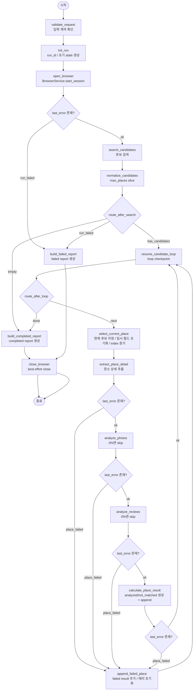
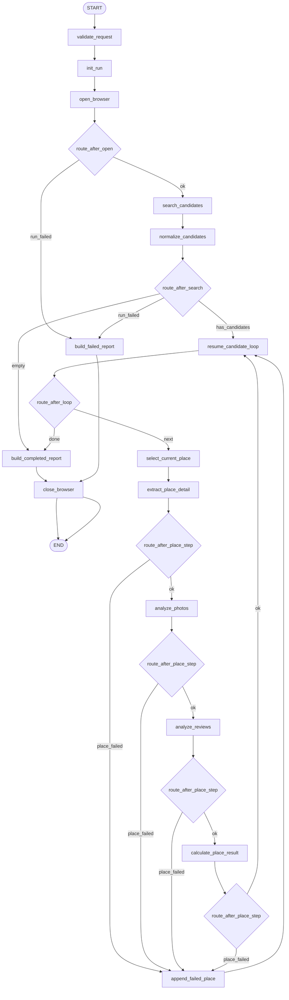

# LangGraph 실행 루프 설계

**작성일:** 2026-07-14

**대상:** README 로드맵 2-5 `LangGraph 실행 루프 구현`

**기준 문서:**
- `docs/superpowers/specs/2026-07-12-langgraph-agent-core-design.md`
- `docs/superpowers/specs/2026-07-13-browser-service-design.md`
- `docs/superpowers/specs/2026-07-13-analysis-nodes-design.md`

## 1. 목표

`BrowserService`, 사진/리뷰 분석 Agent, 점수 계산 Service를 LangGraph 하나로 묶어
실행 루프를 구현한다.

- 실행 시작 시 `run_id`와 초기 `GraphState` 생성
- 네이버지도 후보 검색 후 Graph 계층에서 `max_places`만큼만 선택
- 후보를 병렬 없이 순차 처리
- 장소별 사진/리뷰 분석과 점수 계산 연결
- 장소별 운영 실패를 `failed` 결과로 기록하고 다음 후보로 계속 진행
- `analyzed`, `not_matched`, `failed` 결과를 `place_results`에 누적
- 실행 종료 시 메모리상 `RunReport` 생성
- 성공/실패와 무관하게 브라우저 세션 정리 보장

## 2. 범위 제외

- Navigation recovery agent 연동
- 동일 장소 재시도 정책과 retryable/terminal failure 분류
- `RunReport`의 JSON 파일 저장
- WebSocket/SSE 스트리밍
- checkpointer, resume, human-in-the-loop
- 후보 병렬 분석

최소한의 `failed` 결과 누적과 loop 지속은 2-5에 포함한다. recovery와 재시도
고도화는 현재 범위에서 제외하고, JSON 파일 출력은 2-7에서 다룬다.

## 3. 확정 결정

### 3.1 2-5의 실패 처리 경계

2-5는 정상 경로, `not_matched`, `failed` 누적까지 담당한다.

- 후보 검색 성공
- 장소 상세 추출 성공
- 사진/리뷰 분석 성공
- 점수 계산 성공
- `analyzed`, `not_matched` 누적
- 장소별 실패 시 `failed` append 후 다음 후보 진행

아래 경우는 2-5에서도 run-level fatal로 취급한다.

- 브라우저 세션 시작 실패
- 후보 검색 실패
- report 생성 node 자체 실패
- 프로그래밍 오류나 모델 계약 위반

위 실패는 실행 전체를 `RunStatus.FAILED`로 종료하는 run-level failure로 처리한다.
이미 누적된 `place_results`는 유지하고, `errors`에 마지막 글로벌 오류 문자열을 넣어
`RunReport`를 만든다.

### 3.2 Graph와 BrowserService의 책임 분리

후보의 광고 제거, 중복 제거, 장소 ID 보강은 이미 `BrowserService` 책임이다.
Graph는 브라우저에서 받은 후보를 다시 DOM 기준으로 정규화하지 않는다.

2-5에서 Graph가 추가로 담당하는 후보 처리만 남긴다.

- `RunConfig.max_places`만큼 slice
- 순차 처리 순서 결정
- 현재 후보 인덱스 관리

즉, 상위 설계의 `normalize` node는 2-5 구현에서
`normalize_candidates = candidates[:max_places]` 의미로 축소한다.

### 3.3 place 결과 append 방식 단순화

상위 초안에는 `appendAnalyzed`, `appendNotMatched`, `appendFailed`, `routeMatch`가
분리돼 있다. 하지만 현재 구현 경계에서는 `PlaceScoringService.calculate()`가 이미
`analyzed`와 `not_matched`를 결정한다.

따라서 2-5 MVP에서는 다음처럼 단순화한다.

- `calculate_place_result` node에서 `analyzed` 또는 `not_matched` 생성 후 append
- `append_failed_place` node에서 `failed` 생성 후 append
- 별도 `routeMatch`, `appendAnalyzed`, `appendNotMatched` node는 두지 않음

이 방식은 `GraphState`에 `current_result` 같은 임시 필드를 추가하지 않아도 돼
현재 모델을 그대로 유지하기 쉽다.

### 3.4 0% 가중치 분석은 node 내부에서 skip

가중치가 0%인 분석은 graph 구조 분기 대신 node 내부 no-op로 처리한다.

- `photo_percent == 0`이면 `analyze_photos`는 `photo_analysis = None`으로 유지
- `review_percent == 0`이면 `analyze_reviews`는 `review_analysis = None`으로 유지

graph topology를 가중치마다 바꾸지 않고, 현재 고정 루프를 유지한다.

### 3.5 place-level failed는 run failed가 아님

장소별 실패가 있었다고 run 전체를 `failed`로 내리지 않는다.

- loop를 끝까지 돌면 `RunReport.status = completed`
- 개별 장소 실패 정보는 `PlaceResult(status="failed")`와 `failure_reason`에 기록
- completed report의 `errors`는 기본적으로 비운다
- `RunReport.errors`는 run-level/global error 용도로만 사용한다

따라서 extract/analyze/calculate 단계 오류는 routing 함수가 `append_failed_place`로
보내고, append 후 `route_after_loop`로 복귀한다.

run-level fatal만 `RunReport(status="failed")`로 마무리한다.

### 3.6 브라우저 정리는 graph와 외부 wrapper에서 이중 보장

성공 경로에서는 `close_browser` node를 둔다.
추가로 공개 진입점 `run()`도 `finally`에서 `close_session(run_id)`를 다시 호출한다.

이유:

- graph 내부 node가 실패하면 종료 node까지 도달하지 못할 수 있음
- `BrowserService.close_session()`은 멱등이므로 중복 호출 비용이 낮음
- 테스트에서 정리 보장을 검증하기 쉬움

### 3.7 Graph-level throttle은 2-5에서 두지 않음

상위 설계에는 `throttle` node가 있지만, 현재 코드 기준 최소 안전 장치는
`BrowserService` 내부 `InteractionPacer`가 이미 제공한다.

2-5에서는 별도 sleep node를 추가하지 않는다.

- 브라우저 상태 변경 간 최소 3초 대기: `InteractionPacer`
- 재시도 전 5초 대기: `InteractionPacer`
- OpenAI 호출 사이 graph-level sleep: 없음

추후 사용자 설정 기반 pacing이 필요하면 그때 별도 node나 설정 필드를 추가한다.

## 4. 2-5 실제 graph 흐름

기본 설계의 큰 방향은 유지하되, 현재 구현 경계에 맞게 최소 node 집합으로 줄인다.



### 4.1 LangGraph node 조립 기준 다이어그램

아래 그림은 의미 중심 흐름도가 아니라, 실제 `StateGraph.add_node()`와
`add_conditional_edges()` 관점에서 본 graph 구조다.

- 사각형: 실제 `add_node()`로 등록하는 node
- 마름모: 실제 node는 아니고 `add_conditional_edges()`에 넘기는 route 함수
- edge 라벨: route 함수가 반환하는 분기 문자열



이 그림 기준으로 구현하면 route 함수는 총 4개다.

- `route_after_open`
- `route_after_search`
- `route_after_loop`
- `route_after_place_step`

실제 Python 코드에서는 `route_after_place_step` 하나를 재사용하고,
`extract`, `analyze_photos`, `analyze_reviews`, `calculate_place_result`
뒤에 각각 연결하는 형태가 된다.

## 5. 모듈 구조

불필요한 분리를 피하고 2-5 범위만 구현한다.

```text
src/datespot_agent/graph/
├── __init__.py      # GraphRunService 공개 export
└── service.py       # graph 조립, node, route, report 생성 node

tests/
└── run_graph_live.py  # 네이버지도/OpenAI 수동 통합 실행기
```

구조 선택 이유:

- node 수가 많아도 현재 의존성은 4개뿐이라 파일 하나에 유지 가능
- 후속 단계에서 파일 출력이 추가되면 그때 분리해도 늦지 않음
- 실제 브라우저와 OpenAI를 연결한 실행 확인은 별도 수동 실행기로 분리
- 현재 요청 기준 최소 변경에 맞음

## 6. 공개 인터페이스

```python
class GraphRunService:
    def __init__(
        self,
        *,
        browser_service: BrowserService,
        photo_agent: PhotoAnalysisAgent,
        review_agent: ReviewAnalysisAgent,
        scoring_service: PlaceScoringService,
        clock: Callable[[], datetime] = utc_now,
    ) -> None: ...

    async def run(self, config: RunConfig) -> RunReport: ...
```

동작 규약:

- `run()`이 실행 전체 진입점
- 내부에서 `run_id` 생성
- 내부에서 compiled graph를 `ainvoke()`로 실행
- 최종적으로 `RunReport`를 반환
- 성공 시 `status="completed"`
- 운영 실패 시 `status="failed"`

`Settings`, `AsyncOpenAI`, 모델명 조합은 바깥 계층에서 끝내고,
`GraphRunService`는 이미 구성된 의존성만 받는다.

## 7. GraphState 운용 규칙

현재 `GraphState` 필드를 그대로 사용한다.

핵심 필드 역할:

- `run_id`: 브라우저 세션 키
- `status`: `pending -> running -> completed|failed`
- `candidates`: Graph가 실제로 순회할 후보 목록
- `current_place_index`: 다음에 선택할 후보 인덱스
- `current_place`: 현재 처리 중 후보
- `current_place_detail`: 상세 추출 결과
- `photo_analysis`, `review_analysis`: 현재 후보의 분석 결과
- `place_results`: 누적 결과
- `final_report`: 마지막 리포트
- `last_error`: 직전 step 실패 메시지. `append_failed_place` 또는
  `build_failed_report` 분기에 사용

place 전환 시 `select_current_place`에서 아래 필드를 반드시 초기화한다.

- `current_place_detail = None`
- `photo_analysis = None`
- `review_analysis = None`
- `last_error = None`

## 8. node별 설계

### 8.1 validate_request

역할:

- `RunConfig`가 이미 모델 검증을 통과했다는 전제에서 추가 제약만 확인
- 현재 단계에서는 사실상 no-op에 가깝게 유지

검사 항목:

- `max_places >= 1`
- `weights` 합계 100

실패 시:

- 계약 위반으로 보고 예외 전파 허용

### 8.2 init_run

역할:

- `GraphState` 생성
- `status = running`
- 빈 누적 리스트/임시 필드 준비

`run_id` 형식:

- `run_YYYYMMDD_HHMMSS_<8hex>` 권장
- 사람이 로그에서 읽기 쉬우면서 충돌 위험 낮춤

### 8.3 open_browser

역할:

- `browser_service.start_session(run_id)` 호출

잡는 예외:

- `BrowserServiceError`
- 그 외 브라우저 시작 단계의 운영 예외

실패 시:

- `last_error` 설정
- `status`는 아직 `running` 유지
- 즉시 `build_failed_report`로 보냄

### 8.4 route_after_open

분기 순서:

1. `last_error`가 있으면 `run_failed`
2. 그 외 `ok`

### 8.5 search_candidates

역할:

- `browser_service.search_candidates(run_id, config)` 호출
- 반환 후보를 state에 저장

실패 시:

- `last_error`에 글로벌 오류 메시지 저장
- `candidates = []`

### 8.6 normalize_candidates

역할:

- `state.candidates = state.candidates[:config.max_places]`

추가 정규화는 하지 않음.

### 8.7 route_after_search

분기 순서:

1. `last_error`가 있으면 `run_failed`
2. `candidates`가 비어 있으면 `empty`
3. 그 외 `has_candidates`

### 8.8 route_after_loop

분기 조건:

- `current_place_index < len(candidates)`이면 `next`
- 아니면 `done`

### 8.9 resume_candidate_loop

역할:

- 실제 작업 없이 loop 재진입 지점을 하나로 모음
- `route_after_loop`를 검색 직후와 장소 처리 직후에 공통 재사용하게 함

이 node는 `StateGraph` 조립에서 conditional edge의 source를 통일하기 위한 checkpoint다.

### 8.10 select_current_place

역할:

- `current_place = candidates[current_place_index]`
- `current_place_index += 1`
- place 단위 임시 필드 초기화

이 node가 인덱스를 증가시키면 이후 failure가 나도 "이미 시도한 후보"로 간주하기
쉬워진다.

### 8.11 extract_place_detail

역할:

- `browser_service.extract_place_detail(run_id, current_place)` 호출
- 성공 시 `current_place_detail` 저장

잡는 예외:

- `BrowserServiceError`

실패 시:

- `last_error = str(error)`
- `current_place_detail = None`
- `append_failed_place` 경로로 이동

### 8.12 analyze_photos

역할:

- `photo_percent == 0`이면 skip
- 아니면 `photo_agent.analyze(current_place_detail, config.scoring.photo)` 호출

잡는 예외:

- `AnalysisError`

실패 시:

- `last_error = str(error)`
- `photo_analysis = None`
- `append_failed_place` 경로로 이동

### 8.13 analyze_reviews

역할:

- `review_percent == 0`이면 skip
- 아니면 `review_agent.analyze(current_place_detail, config.scoring.review)` 호출

잡는 예외:

- `AnalysisError`

실패 시:

- `last_error = str(error)`
- `review_analysis = None`
- `append_failed_place` 경로로 이동

### 8.14 calculate_place_result

역할:

- `scoring_service.calculate(...)` 호출
- 반환 `PlaceResult`를 `place_results`에 append

잡는 예외:

- `AnalysisInputError`

실패 시:

- `last_error = str(error)`
- `append_failed_place` 경로로 이동

성공 시:

- `last_error = None`
- `current_place_detail`, `photo_analysis`, `review_analysis`는 유지해도 되지만,
  가독성을 위해 node 끝에서 `None`으로 비워도 무방함

### 8.15 route_after_place_step

`extract_place_detail`, `analyze_photos`, `analyze_reviews`,
`calculate_place_result` 뒤에서 공통으로 사용한다.

분기 순서:

1. `last_error`가 있으면 `place_failed`
2. 그 외 `ok`

### 8.16 append_failed_place

역할:

- `PlaceResult(status="failed")` 생성
- `place_results`에 append
- 다음 후보 진행 전에 임시 필드와 `last_error` 초기화

실패 결과 필드 규칙:

- `place_id`, `name`: `current_place` 기준
- `category`, `address`: `current_place_detail`이 있으면 함께 기록
- `failure_reason`: `last_error`

이 node는 별도 서비스 없이 graph 내부 helper로 유지한다.

## 9. report 생성 node 설계

### 9.1 build_completed_report

역할:

- `status = completed`
- 누적 결과 정렬
- `RunReport` 생성 후 `final_report` 저장
- `errors = []`

정렬 규칙:

1. `analyzed` 먼저
2. `analyzed.final_score` 내림차순
3. `not_matched` 다음
4. `failed` 마지막
5. 같은 그룹 안에서는 기존 append 순서 유지

### 9.2 build_failed_report

역할:

- `status = failed`
- 현재까지 누적된 결과는 그대로 유지
- `errors = [last_error]`
- `RunReport` 생성 후 `final_report` 저장

주의:

- 이 node는 `open_browser`, `search_candidates`, report 생성 전 단계 같은
  run-level fatal에만 사용한다
- place-level failure는 여기로 오지 않고 `append_failed_place`로 처리한다

### 9.3 created_at과 clock

`RunReport.created_at`은 report 생성 node에서 한 번만 생성한다.

- 기본 clock: UTC now 반환 함수
- 테스트에서는 고정 clock 주입

## 10. close_browser 설계

`close_browser` node는 best-effort 정리만 수행한다.

- `await browser_service.close_session(run_id)`
- close 예외는 삼킴
- `final_report`와 `status`는 바꾸지 않음

공개 `run()`도 `finally`에서 다시 `close_session(run_id)`를 호출한다.

## 11. LangGraph 조립 방식

graph는 `GraphRunService` 초기화 시 1회 compile한다.

- 모든 node는 instance method 또는 private callable로 둠
- 실행별 입력은 `GraphState`
- 실제 호출은 `await compiled_graph.ainvoke(initial_state)`

주의점:

- LangGraph 1.2.8에서 node는 Pydantic model state를 입력으로 받을 수 있음
- compiled graph 결과는 dict 형태이므로 `GraphState.model_validate(...)`로
  다시 감싸 최종 state를 읽는다

이 변환을 `run()` 내부에 숨겨 외부에는 `RunReport`만 노출한다.

## 12. 검증 전략

2-5에서는 전용 graph 단위 테스트를 추가하지 않고, 기존 하위 계층 자동 테스트와
수동 통합 실행으로 검증한다.

### 12.1 자동 회귀 검증 범위

- `RunConfig`, `GraphState`, `RunReport` 모델 계약
- `BrowserService` 검색·상세 추출·세션 정리
- 사진/리뷰 분석 Agent 입력·응답 처리
- `PlaceScoringService`의 가중치·기준 충족 판정
- 전체 기존 테스트 재실행

`GraphRunService` 자체의 fake 기반 단위 테스트는 2-5 범위에 포함하지 않는다.

### 12.2 수동 통합 실행

`tests/run_graph_live.py` 상단에서 아래 값을 직접 설정한다.

- `LOCATION`, `SEARCH_KEYWORD`, `MAX_PLACES`
- `PHOTO_PERCENT`, `REVIEW_PERCENT`
- `PHOTO_CRITERIA`, `REVIEW_CRITERIA`
- 필요 시 `MODEL_OVERRIDE`, `BROWSER_CHANNEL`, `HEADED`, `OUTPUT_PATH`

`.env`에 `OPENAI_API_KEY`를 설정한 뒤 실행한다.

```bash
uv run python tests/run_graph_live.py
```

이 스크립트는 실제 네이버지도와 OpenAI API를 호출하므로 자동 테스트 탐색에는
포함하지 않는다. `OUTPUT_PATH=None`이면 최종 `RunReport` JSON을 stdout에 출력한다.

기본값은 로컬 Chrome 채널을 headed 모드로 실행한다. 네이버 보안 확인 화면이
표시되면 `artifacts/browser/<run_id>/`에 스크린샷과 HTML을 한 번 저장하고,
사용자가 화면에서 확인을 완료할 때까지 10초 간격으로 재확인한다. 차단 신호가
사라지면 중단했던 브라우저 작업을 재개한다.

### 12.3 수동 확인 항목

- 브라우저 세션 시작과 후보 검색 로그 출력
- `max_places` 이하 후보를 순차 처리
- 활성 가중치에 해당하는 사진/리뷰 분석 실행
- 장소 결과를 `analyzed`, `not_matched`, `failed` 중 하나로 누적
- 최종 report 상태와 결과 수 출력
- 성공·실패와 무관한 브라우저 세션 정리 로그 출력

## 13. 2-7 확장 포인트

### 13.1 2-7에서 바뀌는 지점

- `build_completed_report`, `build_failed_report` 이후 report JSON 저장
- 저장 경로와 파일명 규칙 확정
- 파일 저장 실패를 run failure로 볼지 별도 후처리 오류로 볼지 결정

## 14. 구현 결과

1. `GraphRunService`와 `run()` 공개 진입점 추가
2. `max_places` slice와 순차 후보 loop 구현
3. 사진·리뷰 분석과 점수 계산 연결
4. `analyzed`, `not_matched`, `failed` 결과 누적
5. completed/failed report 생성과 브라우저 정리 보장
6. `tests/run_graph_live.py` 수동 통합 실행기 추가
