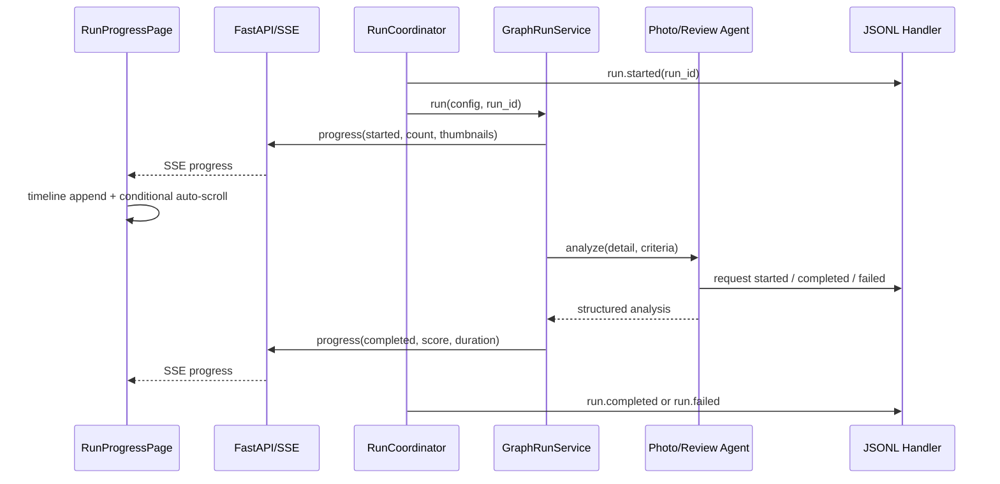

# 실행 관측성·프런트 이벤트 타임라인 설계

**작성일:** 2026-07-15

**대상:** FastAPI 실행 서버, SSE 실행 이벤트, 데스크톱 웹 실시간 진행 화면

**기준 문서:**

- `docs/superpowers/specs/2026-07-15-fastapi-run-api-design.md`
- `docs/superpowers/specs/2026-07-15-realtime-streaming-report-catalog-design.md`
- `docs/superpowers/specs/2026-07-15-frontend-web-app-design.md`

## 1. 목표

실행 장애를 `run_id` 하나로 재구성할 수 있도록 서버 진단 로그를 구조화하고, 실시간
진행 화면에서는 사진·리뷰 분석을 포함한 전체 공개 이벤트를 스크롤로 확인할 수 있게
한다.

- 서버 콘솔 로그와 실행별 JSONL 진단 로그를 동시에 남김
- API, coordinator, 브라우저, graph, 분석, 점수 계산, 리포트 저장을 한 흐름으로 연결
- 오류 원인과 전체 Python traceback을 진단 로그에 보존
- 공개 SSE에는 UI에 필요한 안전한 정보만 전달
- 실제 사진 분석 입력 최대 5장을 실시간 화면에서 썸네일로 표시
- 최근 7개만 표시하는 제한을 제거하고 수신한 진행 이벤트 전체를 탐색 가능하게 함
- 사용자가 과거 이벤트를 읽는 동안 자동 스크롤이 위치를 빼앗지 않게 함

## 2. 비목표

- 외부 로그 수집 서비스, OpenTelemetry, ELK, Sentry 도입
- 여러 프로세스 또는 여러 서버의 로그 집계
- 서버 재시작 뒤 SSE 이벤트 전체를 복구하는 영구 이벤트 저장소
- API 키, 쿠키, 인증 헤더, 전체 프롬프트, 리뷰 원문을 저장하거나 화면에 공개
- 사진 파일 자체를 서버에 복제하거나 영구 저장
- 로그 검색·다운로드용 별도 관리 UI

## 3. 확정 결정

### 3.1 진단 로그와 사용자 이벤트 분리

두 채널은 목적과 공개 범위가 다르므로 분리한다.

1. **서버 진단 채널**
   - 사람이 읽는 콘솔 로그
   - 한 줄에 JSON 객체 하나인 실행별 JSONL 파일
   - 예외 타입과 traceback 등 내부 진단 정보 포함
2. **프런트 공개 채널**
   - 기존 `RunEventHub`와 SSE 사용
   - 단계, 상태, 개수, 점수, 소요시간 등 안전한 실행 정보만 포함
   - 원격 사진 URL은 썸네일 제공에 필요한 경우만 제한적으로 포함

서버 진단 레코드를 그대로 SSE에 전송하지 않는다. 내부 경로, traceback, 요청 메타데이터가
브라우저로 노출되는 것을 방지한다.

### 3.2 실행별 JSONL

진단 파일 경로는 다음으로 고정한다.

```text
artifacts/logs/<run_id>.jsonl
```

- `run_id`가 확정된 실행 로그만 파일에 기록
- 실행과 무관한 서버 시작·종료 로그는 콘솔에만 기록
- `artifacts/logs/`는 Git 추적 대상에서 제외
- 각 레코드는 기록 직후 flush하여 비정상 종료 시 손실 범위를 최소화
- 이번 범위에서는 자동 보존 기간과 자동 삭제를 두지 않음
- 파일명에는 검증된 `run_id`만 사용하여 경로 이탈을 차단

### 3.3 민감정보 기준

진단 로그와 SSE의 기본 원칙은 원문 대신 수치와 상태를 남기는 것이다.

기록 허용:

- `run_id`, 요청 ID, 컴포넌트, 액션, 실행 단계
- 장소 ID·이름, 후보/사진/리뷰 개수
- 모델명, 최대 출력 토큰, 요청 성공 여부, 응답 ID가 있으면 응답 ID
- 점수, 매칭 여부, 재시도 횟수, 소요시간
- 안전하게 정리된 오류 메시지, 예외 타입, traceback

기록 금지 또는 마스킹:

- OpenAI API 키와 모든 secret
- Cookie, Authorization 및 인증 관련 헤더
- 사용자 프로필 내부 값과 브라우저 저장 데이터
- 사진 평가 기준과 리뷰 평가 기준을 포함한 전체 프롬프트
- 리뷰 원문
- 사진 URL과 사진 바이너리

`dict`, `list`, 예외 필드처럼 중첩된 값에도 같은 마스킹 규칙을 재귀 적용한다. 키 이름과
값 패턴을 함께 검사하여 `api_key`, `authorization`, `cookie`, bearer token 등을
`[REDACTED]`로 바꾼다.

### 3.4 사진 URL의 제한적 예외

사진 썸네일 표시를 위해 공개 `photo_analysis` 진행 이벤트에 실제 분석 대상 URL을 최대
5개까지 포함한다.

- `http` 또는 `https` URL만 허용
- `PhotoAnalysisAgent`가 사용하는 것과 동일한 선두 최대 5개만 전달
- JSONL·콘솔 진단 로그에는 URL을 기록하지 않음
- 리포트 파일에 새로 저장하지 않음
- SSE replay 메모리에만 기존 이벤트와 같은 수명으로 보관
- 리뷰 원문에는 같은 예외를 적용하지 않음

### 3.5 공개 이벤트 보존 범위

프런트는 현재 페이지 세션에서 수신했거나 SSE replay로 받은 모든 `progress` 이벤트를
렌더링한다. UI에서 임의로 최근 N개를 잘라내지 않는다.

- 서버의 기존 실행별 replay 상한 1,000개는 유지
- 상한을 넘겨 replay reset이 발생하면 기존 snapshot 복구 계약을 유지
- 서버 재시작 전후를 잇는 영구 공개 이벤트 기록은 이번 범위에 포함하지 않음
- 완전한 내부 진단 이력은 실행별 JSONL이 담당

일반적인 한 실행의 이벤트 수는 상한보다 충분히 작으며, UI 문제의 직접 원인인 최근 7개
렌더링 제한을 제거하는 데 초점을 둔다.

## 4. 접근안 비교

### 4.1 프런트 메시지만 늘리는 방식

- 장점: 변경량이 작음
- 단점: traceback, 재시도, 지연 구간, cleanup 실패를 재구성할 수 없음
- 판정: 제외

### 4.2 서버 진단 로그 전체를 SSE로 전달하는 방식

- 장점: 화면 한 곳에서 모든 정보 확인 가능
- 단점: 내부 정보 노출, 큰 payload, 브라우저 메모리 증가, 공개 계약과 진단 계약 결합
- 판정: 제외

### 4.3 구조화 진단 로그와 안전한 공개 이벤트를 분리하는 방식

- 장점: 디버깅 깊이와 사용자 화면 안전성을 함께 확보
- 장점: 기존 `run_id`, `RunEventHub`, progress event 계약 재사용
- 단점: 두 채널의 필드와 마스킹 경계를 테스트해야 함
- 판정: 채택

## 5. 서버 관측성 구조

### 5.1 모듈 구성

관측성 공통 기능을 다음 모듈에 둔다.

```text
src/datespot_agent/
  observability.py       # 실행 context, 구조화 로그 helper, redaction, JSONL handler
```

기존 모듈은 도메인 액션을 구조화 필드와 함께 기록한다.

```text
src/datespot_agent/api/app.py
src/datespot_agent/api/runtime.py
src/datespot_agent/api/coordinator.py
src/datespot_agent/api/events.py
src/datespot_agent/browser/chrome_cdp.py
src/datespot_agent/browser/service.py
src/datespot_agent/graph/service.py
src/datespot_agent/analysis/photo.py
src/datespot_agent/analysis/review.py
src/datespot_agent/analysis/scoring.py
src/datespot_agent/reporting/json_store.py
```

### 5.2 실행 context

coordinator가 worker 실행 직전에 `run_id` context를 설정하고 종료 시 반드시 복구한다.
`contextvars.ContextVar`를 사용하여 같은 async 실행에서 생성된 하위 task에도 ID가
전파되게 한다.

공통 context:

```text
run_id
request_id
component
stage
place_id
place_name
```

모든 필드를 매번 메시지 문자열에 합치지 않는다. 구조화 필드는 `LogRecord`의 extra와
JSON 필드로 전달하고, 콘솔 formatter만 핵심 context를 사람이 읽기 좋은 형태로 붙인다.

### 5.3 JSONL 레코드

기본 레코드는 다음 형태다.

```json
{
  "timestamp": "2026-07-15T04:12:33.123456Z",
  "level": "INFO",
  "event": "analysis.photo.completed",
  "message": "사진 분석 완료",
  "runId": "run_20260715_131200_ab12cd34",
  "component": "photo_analysis",
  "stage": "photo_analysis",
  "placeId": "123456",
  "placeName": "예시 장소",
  "status": "completed",
  "inputCount": 5,
  "score": 8,
  "matched": true,
  "durationMs": 1423
}
```

오류 레코드는 다음 필드를 추가한다.

```text
errorType
errorMessage
traceback
```

로그 writer는 한 프로세스 안에서 lock으로 한 줄 쓰기를 직렬화한다. 매번 append 후
flush하며 JSON 직렬화할 수 없는 값은 안전한 문자열 표현으로 바꾼다. 로그 쓰기 실패가
본 실행을 실패시키지는 않으며, 콘솔에 관측성 자체의 오류를 한 번 기록한다.

### 5.4 이벤트 이름

이벤트 이름은 `<영역>.<대상>.<동작>` 형식으로 고정한다.

주요 이벤트:

```text
api.request.started
api.request.completed
api.request.failed
run.queued
run.started
run.completed
run.failed
browser.launch.started
browser.launch.completed
browser.navigation.started
browser.navigation.completed
browser.security_check.detected
browser.security_check.waiting
browser.security_check.resolved
browser.cleanup.completed
candidate.search.started
candidate.search.completed
place.detail.started
place.detail.completed
analysis.photo.prepared
analysis.photo.requested
analysis.photo.completed
analysis.photo.skipped
analysis.photo.failed
analysis.review.prepared
analysis.review.requested
analysis.review.completed
analysis.review.skipped
analysis.review.failed
scoring.completed
report.save.started
report.save.completed
report.save.failed
sse.subscriber.connected
sse.subscriber.disconnected
sse.subscriber.overflowed
```

### 5.5 소요시간과 실패

외부 I/O와 주요 단계는 `time.monotonic()` 기준으로 소요시간을 계산한다.

- Chrome 시작과 CDP 연결
- 네이버지도 navigation과 후보 검색
- 장소 상세 수집
- 사진 모델 요청
- 리뷰 모델 요청
- 점수 계산
- 리포트 저장
- 전체 run

성공·건너뜀·실패 경로 모두 종료 로그를 남긴다. 예상 가능한 분석 입력 부족은
`WARNING`과 `skipped`, 실행을 중단하는 예외는 `ERROR`와 traceback으로 구분한다.
사용자에게 반환하는 기존 일반화 오류 메시지와 내부 진단 오류를 섞지 않는다.

### 5.6 API 요청 로그

FastAPI middleware가 요청마다 안전한 요청 ID를 생성한다.

- method, 정규화된 route, status code, duration 기록
- URL query 전체와 request/response body는 기록하지 않음
- `run_id` route parameter가 있으면 실행 context에 연결
- SSE는 연결 시작과 종료를 별도 이벤트로 기록
- health polling은 기본 INFO 소음을 줄이기 위해 DEBUG로 기록

## 6. 공개 progress 이벤트 계약

### 6.1 확장 필드

기존 `RunProgressData`에 모두 선택적인 필드를 추가하여 하위 호환을 유지한다.

```python
class ProgressStatus(str, Enum):
    STARTED = "started"
    IN_PROGRESS = "in_progress"
    COMPLETED = "completed"
    SKIPPED = "skipped"
    FAILED = "failed"


class RunProgressData(_FrozenCamelModel):
    stage: ProgressStage
    message: str
    status: ProgressStatus | None = None
    place_id: str | None = None
    place_name: str | None = None
    current: int | None = None
    total: int | None = None
    input_count: int | None = None
    duration_ms: int | None = None
    score: int | None = None
    matched: bool | None = None
    photo_urls: tuple[str, ...] | None = None
```

검증 규칙:

- 개수와 소요시간은 0 이상
- `current`와 `total`이 함께 있으면 `current <= total`
- `score`는 기존 분석 점수 범위인 0~10
- `photo_urls`는 최대 5개, `http`·`https`만 허용
- `photo_urls`는 `stage=photo_analysis`에서만 허용
- 기존 발행자가 새 필드를 생략해도 유효

### 6.2 사진 분석 이벤트

장소마다 최소 다음 공개 흐름을 발행한다.

1. `started`
   - 장소 ID·이름
   - 실제 입력 사진 개수
   - 실제 입력 URL 최대 5개
   - 메시지: `사진 5장 분석 시작`
2. `in_progress`
   - 메시지: `사진 분석 모델 응답 대기 중`
3. `completed`
   - 점수, 매칭 여부, 소요시간
4. `skipped` 또는 `failed`
   - 안전한 사유와 소요시간

사진 URL은 첫 이벤트 한 곳에만 실어 같은 URL을 반복 전송하지 않는다.

### 6.3 리뷰 분석 이벤트

장소마다 최소 다음 공개 흐름을 발행한다.

1. `started`: 실제 입력 리뷰 개수
2. `in_progress`: 모델 응답 대기 상태
3. `completed`: 점수, 매칭 여부, 소요시간
4. `skipped` 또는 `failed`: 안전한 사유와 소요시간

리뷰 원문과 전체 평가 프롬프트는 공개 이벤트에 포함하지 않는다.

## 7. 프런트엔드 타임라인

### 7.1 전체 이벤트 표시

`RunProgressPage`의 `projection.progressItems.slice(-7)`을 제거한다. reducer가 보관한
모든 progress event를 시간순으로 렌더링한다.

오른쪽 rail 전체를 한 덩어리로 스크롤하지 않고 다음처럼 나눈다.

```text
상단 실행 요약             고정
진행 이벤트 타임라인       남은 높이, 세로 스크롤
최신 장소/종료 카드         고정 또는 내용에 맞게 축소
```

타임라인 header는 영역 안에서 sticky 처리해 현재 sequence와 최신 이동 버튼을 계속
확인할 수 있게 한다.

### 7.2 자동 스크롤

타임라인 하단과 사용자의 현재 scroll 위치 차이가 작은 경우에만 새 이벤트를 따라간다.

- 최초 진입과 사용자가 하단에 있을 때: 새 이벤트로 부드럽게 이동
- 사용자가 위로 스크롤한 경우: 현재 위치 유지
- 위치 유지 중 새 이벤트 수신: `새 이벤트 N개` 버튼 표시
- 버튼 클릭: 최신 이벤트로 이동하고 자동 추적 재개
- terminal 이벤트 수신: 과거를 읽는 중이면 강제 이동하지 않음
- `prefers-reduced-motion`이면 즉시 이동

### 7.3 이벤트 항목

각 항목은 다음을 표시한다.

- 발생 시각 `HH:mm:ss`
- 단계명
- 상태 badge
- 장소명
- 메시지
- 현재/전체, 입력 개수, 소요시간처럼 존재하는 수치
- 완료된 분석의 점수와 매칭 여부

필드가 없는 기존 이벤트는 현재 메시지형 UI로 정상 표시한다.

### 7.4 사진 썸네일

`photo_analysis` 이벤트에 `photoUrls`가 있으면 이벤트 본문 아래 가로 스크롤 strip을
표시한다.

- 최대 5장
- 각 썸네일은 고정 비율, `object-fit: cover`
- `loading="lazy"`, `referrerPolicy="no-referrer"`
- 이미지 로드 실패는 해당 칸만 실패 placeholder로 전환
- URL 문자열은 화면에 출력하지 않음
- 썸네일 클릭 시 dialog 기반 확대 미리보기
- dialog는 ESC, 바깥 영역, 닫기 버튼으로 종료 가능
- 키보드 focus와 접근 가능한 사진 순번 label 제공

분석 완료 뒤에도 시작 이벤트가 타임라인에 남으므로 같은 사진을 다시 확인할 수 있다.

### 7.5 타입 계약

프런트에 `RunProgressData`와 `ProgressStatus` 타입을 추가한다. progress item을 표시할 때
`Record<string, unknown>`에서 매번 강제 변환하지 않고, event type에 따라 안전하게
narrowing하는 helper를 둔다. 알 수 없는 선택 필드는 무시하여 서버·프런트 배포 순서에
대한 하위 호환을 유지한다.

## 8. 데이터 흐름



## 9. 오류 처리

### 9.1 진단 로그 실패

- 디렉터리 생성·파일 append 실패가 run을 실패시키지 않음
- console에 `observability.write.failed`를 기록
- 같은 오류의 반복 출력은 제한하여 로그 폭증 방지
- redaction 자체가 실패하면 원본을 기록하지 않고 필드 전체를 `[REDACTED]` 처리

### 9.2 SSE 또는 구독자 지연

- 기존 bounded subscriber queue 유지
- overflow 구독자는 기존 계약대로 종료해 재연결 유도
- overflow와 replay reset을 서버 진단 로그에 기록
- 사진 URL 추가로 event payload가 늘어나지만 최대 5개 문자열로 제한

### 9.3 썸네일 실패

- 한 사진의 네트워크 실패가 SSE 연결이나 타임라인을 실패시키지 않음
- 실패 placeholder와 대체 설명 표시
- 자동 재시도로 원격 서버에 반복 요청하지 않음
- 분석 자체는 서버에서 이미 별도로 진행되므로 UI 이미지 실패와 분리

## 10. 테스트 전략

### 10.1 서버 단위 테스트

- 실행 context 설정·복구와 async task 전파
- JSONL 필수 필드와 camelCase 직렬화
- 서로 다른 `run_id` 파일 분리
- append·flush와 동시 기록 시 한 줄 JSON 무결성
- API key, bearer token, cookie, prompt, 리뷰 원문, 사진 URL 마스킹
- 예외 타입·메시지·traceback 기록
- 로그 writer 실패가 run 결과에 영향 주지 않음
- progress 선택 필드 검증과 기존 payload 하위 호환
- 사진 URL 최대 5개와 scheme/stage 검증

### 10.2 서버 통합 테스트

- queued부터 terminal까지 동일 `run_id`로 로그 연결
- API 요청 ID와 route `run_id` 연결
- 사진·리뷰 started/in_progress/completed 이벤트 순서
- 입력 없음의 skipped 이벤트
- 분석 예외의 공개 메시지와 내부 traceback 분리
- SSE overflow·replay reset 진단 로그

### 10.3 프런트 단위 테스트

- 30개 이상 progress event를 잘라내지 않고 모두 렌더링
- 발생 시각, 상태, 장소, 개수, 점수, 소요시간 표시
- 사진 최대 5장 썸네일 표시
- 이미지 실패 placeholder
- dialog 열기·ESC·닫기와 focus 접근성
- 하단에 있을 때 자동 스크롤
- 과거 위치에서 자동 스크롤 중단과 `새 이벤트 N개` 누적
- 최신 이동 버튼으로 자동 추적 복귀
- 기존 필드만 가진 progress event 표시

### 10.4 회귀 검증

- 전체 Python 테스트
- Ruff와 mypy
- 프런트 typecheck, Vitest, production build
- Playwright로 다수 이벤트·타임라인 스크롤·썸네일 확대 확인
- FastAPI 20003, Vite 10003 환경에서 실제 실행 smoke test

## 11. 완료 조건

- 실행 후 `artifacts/logs/<run_id>.jsonl`만으로 주요 단계와 실패 지점을 추적 가능
- 모든 로그 레코드가 해당 실행과 컴포넌트에 연결됨
- 민감정보 및 사진 URL이 진단 파일에 남지 않음
- 프런트에서 최근 7개 제한 없이 수신한 전체 이벤트를 스크롤 가능
- 과거 이벤트 확인 중 새 이벤트가 화면 위치를 강제로 변경하지 않음
- 사진·리뷰 분석 시작, 대기, 완료/건너뜀/실패가 구분되어 표시됨
- 실제 분석 사진 최대 5장이 썸네일과 확대 보기로 제공됨
- 기존 SSE 재연결과 리포트 화면 동작에 회귀 없음
